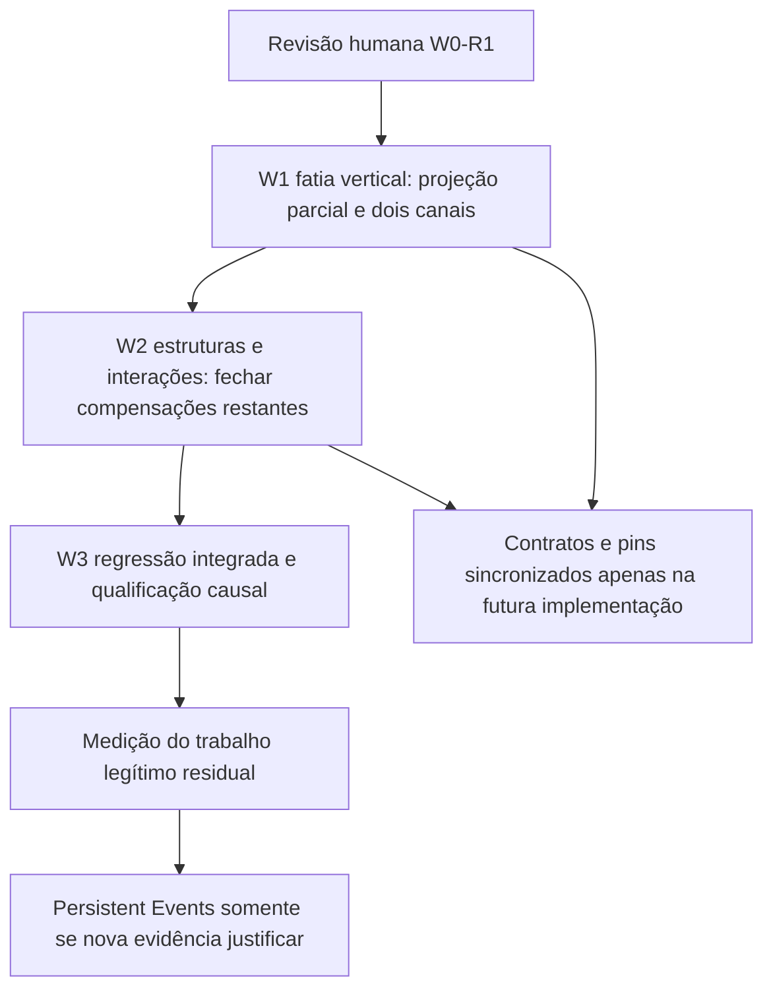

# POSITIVE_MEMORY_TOPOLOGY — W0 / W0-R1 discovery

Campaign: **POSITIVE_MEMORY_TOPOLOGY**

Current wave: **W0 — Discovery; complementação W0-R1, sem nova wave**

Status: **DRAFT / NO MERGE / READY FOR HUMAN ARCHITECTURAL REVIEW**

Branch: `feat/positive-memory-topology`

Anchor: `analysis-cfg`

Merge policy: **HUMAN MERGE ONLY**

Scope: documentation, current-behavior characterization and isolated neutral diagnostics. W1 is not authorized by this report.

## 1. Decisão vigente e revisão da W0

**W0-R1 adota a semântica positiva de toda a abstração suportada, incluindo a origem dos efeitos nos producers.** O produto opera com o que representa hoje. Características omitidas continuam no relatório de cobertura e não recebem efeitos substitutos de pior caso. A decisão vale para armazenamento, representação, valores, expressões, controle, interações, efeitos, metadados e interpretação; os exemplos desta investigação não são uma whitelist.

Aceitam-se diferenças, falsos positivos e falsos negativos frente ao COBOL completo. Evoluir a cobertura poderá aumentar **ou diminuir** candidatos. Não se promete equivalência com a linguagem completa, pureza concreta da operação omitida ou melhoria monotônica. Nenhum modo strict/research/legacy restaurará a filosofia anterior.

A W0 original, no commit `5ca5044355b860c17a917ea1ecba59ae9da4f2ee`, permanece evidência histórica. Sua explicação do fan-out e a escolha de `StorageId` + `Cell`/`Region` + bindings/ranges continuam válidas. **Foi superada a regra “publicado explicitamente, portanto KEEP”**: o producer pode ter transformado uma ausência de implementação em Unknown, MAY ou AllMemory. A matriz causal em §7 substitui aquela classificação, e §§4, 8, 10–14 e 18–24 contêm a proposta autoritativa revisada.

As medidas W0 de 32 bases/100 escritas — 3.200→100 targets, 159.650→0 posições históricas de Events compactos — são controles de sensibilidade à disjunção, não medidas da nova política de gaps. W0-R1 acrescenta 17 caracterizações sintéticas da pipeline real, um probe de metadados e um controle de Unknown legítimo. Nenhum desses exercícios implementa a proposta. [W0-PERFORMANCE](W0-PERFORMANCE.md)

## 2. Effective baseline, stack and campaign lifecycle

Observed remotely on 2026-09-20. All open product PRs below had successful exact-head Fast CI checks. IR has no open PR and no checks in its recent PR metadata. “Qualified” here means technical checks and recorded qualification, not new human merge approval.

| Repo | Effective base PR | Base branch | Exact SHA | Stack relationship |
| --- | --- | --- | --- | --- |
| proleap-poc | [#56](https://github.com/Gustavo2358/proleap-poc/pull/56) | `feat/source-dependencies-w3` | `edb64520a6269be9fa6d71cd47e6974112fbfece` | #55 Logical Text → #56 Source Dependencies; #57 Dependency Preservation already merged into #56 |
| cobol-lower | [#32](https://github.com/Gustavo2358/cobol-lower/pull/32) | `feat/source-dependencies-w3` | `f8e181f95929c650181c989318f8ba23d1e68a1a` | #31 Logical Text → #32 Source Dependencies; #33 already merged into #32 |
| air-java | [#20](https://github.com/Gustavo2358/air-java/pull/20) | `feat/logical-text-w1` | `646ca3ab1687d43f7d2063fc2a8f3837ab3cf9fa` | Open on main; carries both logical-text transport waves |
| analysis-ir | [#7, merged](https://github.com/Gustavo2358/analysis-ir/pull/7) | `main` | `3fff18e2c16663a3f599207457caa1946d2e0945` | Current remote main, includes file-resource contract; no open stack |
| analysis-cfg | [#43](https://github.com/Gustavo2358/analysis-cfg/pull/43) | `feat/source-dependencies-w3` | `98fa57c3db2edf9f70bb7a99bb667dbf36d28104` | #42 Logical Text → #43 Source Dependencies; #44 already merged into #43 |

The new branch was created at the **exact CFG #43 head**, not local main `3477530`. #42 ancestry was verified. Existing source locks match the four upstream effective SHAs above; **no repin** occurred. The baseline contains dependency-preservation fixes and logical group/overlay handling. The original heads quoted in old PR bodies are historical and are not substituted for current heads.

Only the anchor repo changes in W0. Its permanent campaign PR targets `feat/source-dependencies-w3`, stays DRAFT, and accumulates W1..Wn commits. Open corresponding `feat/positive-memory-topology` PRs in other repos when they actually change, on these qualified tips or on their reconciled actual merges. Do not open a PR per wave. Future parent merges require recorded ancestry/tree comparison and explicit retarget/reconciliation, without silently replacing the baseline, rebuilding the campaign or force-pushing unnecessarily.

E2E evidence repo is local-only and already dirty; its roadmap remains unchanged. Isolated campaign worktree: `.positive-memory-topology/analysis-cfg`. Existing worktrees were not switched/reset/stashed. [W0-EVIDENCE](W0-EVIDENCE.md)

## 3. Current semantic contract — Q3

Historical W0 evidence / CURRENT_BEHAVIOR; proposed policy is governed by §§4, 7–8 and 18–24.

AIR §03.1 separates logical object, declared storage and contextual location. §03.3/3.1 requires producer-established separation and defines publication-wide pairwise `disjoint_storage`; §03.5 explicitly says nominally different regions need not be physically different. §07 requires materialized producer facts; §06 preserves incomplete coverage and provenance. Those rules currently coexist with “consumer does not complete missing source semantics.” The architectural tension is real. [IR1] [IR2] [IR3]

`StorageIndex.disjoint` checks empty ranges, same-base nonintersection, then common premise membership for different bases. `DisjointStorage(A,B)` and `(B,C)` do **not** establish `(A,C)`. `StorageIndexTest.disjointPremisesAreNotTransitiveAndCodecDoesNotChangePhysicalOverlap` freezes this; `distinctBasesRequirePremiseAndLifetimeQualifiesActivationOnly` freezes the ID rule. These are current-contract oracles, not proof that every source needs cross-base MAY. [C1] [T1]

The declarative premise was introduced in IR commit `a6b771e`; physical target expansion appears in CFG `f80faac` (ST-W2.1). Historical WORK-CFG-028 challenges deliberately reject “storage ID implies disjoint.” That is an intentional conservative design, not accidental missing optimization. A migration must replace those oracles under the new authority, preserve their historical evidence, and retain actual overlap tests.

**A fixture would change:** the three-base nontransitivity case and the two-base no-premise case would become independent under the new contract. Neither publishes a positive A↔C overlap. If possible common storage is intended, publish common-region views, an exact AliasBinding, or AlternativesBinding/UnknownBinding with an explicit bounded scope. Actual same-region overlays already have positive representation and must remain overlapping. No inspected qualified fixture requires *unpublished* cross-base alias as the only way to represent a real overlap; general external/pointer producers have not been qualified and remain a migration risk, not a universal absence claim.

## 4. Contrato proposto: semântica suportada, cobertura e integridade

Para **cada contribuição**, perguntar: qual comportamento da abstração suportada justifica este efeito ou alternativa? Ou ele existe somente porque algo não foi modelado? Publicação tipada é necessária para efeitos explícitos, mas não legitima sua causa. As categorias abaixo substituem os significados A–D usados na W0 original:

| Categoria | Significado | Consequência proposta |
| --- | --- | --- |
| A — semântica suportada | Identidades, relações, operações, leituras, escritas, alternativas e continuações modeladas | Calcular normalmente; preservar entidades e estrutura |
| B — indeterminação interna ao modelo | Valor de entrada/retorno modelado, escolha estrutural ou destino aberto positivamente definido pela abstração | Unknown/Choice/MAY e escopo correspondente continuam semânticos, com força e timing publicados |
| C — ModelingGap | Implementação ausente, detalhe omitido, representação/evaluador/materialização/prova exigida apenas para maior fidelidade à fonte | Diagnóstico com origem e aspecto; nenhum efeito substituto, unknown local/global, enfraquecimento de kill, alias, salto, produtor, Event, recusa da análise suportada ou perda da construção inteira |
| D — entrada inválida/quebra de contrato | IDs contraditórios, referência inexistente, estrutura/faixa/tipo incoerente; consumer incapaz de executar operação AIR prometida como suportada | Erro real ou incompatibilidade operacional explícita. Não reinterpretar como gap inofensivo |

Uma operação pode conter A+B+C. Em ACCEPT, o destino e a entrada podem ser modelados, o conteúdo externo pode ser B, e uma opção não implementada pode ser C. Em uma transformação não implementada, reconhecer o verbo/destino não autoriza automaticamente substituir o valor por unknown. A classificação deve seguir a regra de abstração de cada aspecto, não o nome do statement ou da classe Java.

Lei de memória: bases distintas têm identidade de estado independente no modelo; compartilhamento modelado usa a mesma base ou relação positiva. `ObjectId`, Unit owner e `StorageId` não são equivalentes. Preservam-se aliases, grupos, REDEFINES/RENAMES e vistas suportados. Disjunção não exige prova física completa da linguagem fonte.

Lei de controle: preservar o grafo reconhecido, seus braços, destinos, joins, retornos, continuação e repetição modelada. Sem avaliação de predicado, a abstração estrutural pode manter ambos os braços. O diagnóstico não adiciona alternativas externas à estrutura. A expressão histórica “gap nunca aumenta estados” não é um oráculo válido ao comparar abstrações de precisão diferente.

Lei de projeção: é permitido omitir o **efeito não modelado** e registrar sua cobertura. Isso não afirma no-op concreto. É proibido apagar as partes suportadas, inventar largura zero, conversão ou codec exato, preservar constante morta frente a escrita semântica B, ou converter toda entrada AIR antiga Unknown em ModelingGap. Producer e consumer deverão migrar coordenadamente; nenhum filtro genérico de AllMemory/Unknown é proposto.

## 5. Current memory topology — Q2

Historical W0 evidence / CURRENT_BEHAVIOR; proposed policy is governed by §§4, 7–8 and 18–24.

| Concept | Meaning established by implementation | Allocation relationship |
| --- | --- | --- |
| `Memory.Cell` | One abstract typed value; no byte extent | State slot; not necessarily one physical source declaration. Logical lowering also uses root/projection cells |
| `Memory.Region` | Byte sequence with known extent or explicit `extentUnknown` | Often one proved source storage component; current AIR does not guarantee distinct Region IDs imply disjointness |
| `StorageIndex.Location.base` | Existing `StorageHeader` of Cell or Region | Not a new allocation object; header carries StorageId, optional Unit owner, lifetime, visibility, origin |
| `ObjectDeclaration` | Nominal declaration + binding | Several objects can name the same location; distinct object IDs never imply independence |
| `ViewBinding` | Region + constant byte offset/extent + codec | Same region, intersecting half-open intervals means shared bytes |
| `AliasBinding` | Resolves referenced object binding | Exact same view/location, not an arbitrary overlap |
| `AlternativesBinding` / `Places.Choice` | Enumerated locations plus explicit remainder | Preserve all alternatives, even when bases are independent |
| `RegionSlice` | Region plus evaluated offset/length | Current resolver handles constants precisely; calculated bounds open only the region before secondary target amplification |
| `owner` | Unit ownership for visibility/lifetime | One Unit owns many independent variables; it is **not** allocation identity |
| activation | Location contextualized with EntryId; persistent/external without that activation suffix | Must preserve context abstraction; IDs alone must not merge activations |

Evidence: model [A1]; `StorageIndex` binding/resolve/whole/contextualization [C1]; fixture exact alias and adjacent ranges [T1].

Frontend `StorageComponents.components` collects a contiguous proved REDEFINES sibling component. `StorageLayoutSemantics` chooses the root component representative as base; descendants share that base, member overlays share the start, and group child offsets advance by component footprint. Extent uses supported shapes; unknown layout does not fabricate offsets. Thus a base is not “one declaration”: it can cover several redefinitions and all group descendants. RENAMES has no new allocation; proved endpoints create a view of its owning root. File record components also share source storage where positively established. [F1] [F2] [F3] [F5]

Lower `RegionalDataTranslator` maps each published source BaseId once to a StorageId. A standalone admitted scalar may represent that component as a Cell without a duplicate Region; precise physical objects use ViewBinding. It skips an unproved base with unknown extent, records `STORAGE_ALLOCATION_UNAVAILABLE`, and creates bounded or global UnknownBinding for remaining objects. Thus not every SP base currently becomes a Region. Proven allocation controls PRIVATE vs UNKNOWN visibility; Unit owner still does not separate allocations. [L1]

## 6. Source → product → lower → AIR → analyzer → output

Historical W0 evidence / CURRENT_BEHAVIOR; proposed policy is governed by §§4, 7–8 and 18–24.

```text
COBOL declarations / operations
  StorageComponents (root allocation, overlays, scoped uncertainty)
  StorageLayoutSemantics / StorageRenames (bases, ranges, views)
  StatementEffectSummary / file and CICS effect facts
    ↓ explicit SP storage, logicalTextViews, move/access/effect facts, coverage
RegionalStorageAdmission / RegionalDataTranslator / StoragePremise
LogicalTextIndex / LogicalTextMove; operation-specific handlers
    ↓ Memory.Cell/Region, bindings, Assign/CopyBytes/Invoke/Opaque, scopes
AIR model + validator + JSON binding
    ↓ admitted immutable Publication / CFG / AnalysisSession
StorageIndex → StatementEffects → StoragePartition / RD
    ↓ prepared physical or logical plans, events, correlation groups
RegionalValuesAnalysis.Engine.apply / existing PossibleValues
    ↓ stable result + replay / BEFORE observation + detached supports
CallDependencyPlan / CallDependencyConsumer; FILE/CICS consumers
    ↓ candidates, model/source/interpretation remainders, provenance
dependencies.json (baseline 2.5.0); source dependencies join separately
```

The language-specific facts stay in frontend; lower validates/translates published facts and builds neutral expressions. The proposed consumer needs no COBOL recognition. Logical group projections are operational AIR assignments, not covert physical aliases. Source COPYBOOK/DCLGEN/DB2_TABLE dependencies do not use regional writes and must remain unaffected. [F1] [F2] [L1] [L3] [C1] [C2] [C3] [C10] [C11]

### 6.1 Logical route compared with physical — Q8

The operational default is logical-only. `LogicalTextIndex` validates frontend-published **character** coordinates; `LogicalTextMove` builds `Read/FitText/SliceText/Concat`, updates an authoritative root Cell and assigns projections to related view Cells. REDEFINES and RENAMES participate in the published root family. Source snapshot reads occur before the root update; branch alternatives of the whole root preserve within-family correlation. These assignments explicitly state the relationships; the consumer does not rediscover COBOL layout. [L3] [L4] [D1]

`TextProfile` uses direct Cell identities and backwards demand closure over expression reads. It prepares only demanded cells and their source closure, but still requires a covering DisjointStorage premise today. The broader regional provider in LOGICAL_ONLY compiles only explicit logical named targets and same-Cell bindings; physical bases/plans are disabled. It can still pay StatementEffects preparation cost when that provider is selected, so “no physical apply” does not universally mean “no preparation fan-out.” The common admitted scalar route avoids that preparation. [C5] [C3] [C10]

| Property | Logical operational route | Physical route |
| --- | --- | --- |
| Coordinates | Source-proved text characters and pure expressions | Region bytes, codecs and intervals |
| Aliasing/group update | Explicit root/projection Assign operations | Positive same-region overlap plus current absence-proof fan-out |
| Alternatives | Whole-root scalar candidates, supports and unknown remainder | Segment/correlation relations, byte fragments, captured provenance |
| Work bound | Demand closure for supported scalar profile | All prepared physical targets; per-group projection/replay |
| Reusable idea | One authoritative root, explicit relationships, demand before detailed state | Reuse base/range topology; retain byte-copy/codec behavior |

Prior logical W2 scale at 10/100/1000 irrelevant families retained 5 detailed Cells, 6 writes and 6 producers, with zero physical plans/groups/writes in that selected route. Parsing/serialization/CFG/heap still grew; 10,000 was not measured for analysis because upstream serialization failed. This is **reused evidence**, not a new W0 timing run. Physical topology is not replaced by text coordinates: byte codecs, partial copies, unknown extents and general physical views remain fundamentally different. The scalar disjointness admission must still migrate; logical-only is not already a complete closed-world implementation. [D1]

## 7. Matriz causal W0-R1: origem, conversão e decisão

As referências [F…], [L…], [C…], [A…] e [T…] têm SHA imutável e caminho completo no [índice](W0-EVIDENCE.md). Nas células, `F6:1067–1127` significa método/linhas desse arquivo **na baseline de §2**, não na branch móvel. A classificação é por contribuição. “Observado” identifica execução nova; demais consequências são leitura causal do código, sem alegar execução de todas as variantes.

| ID / aspecto suportado e causa | Conversões relevantes e ponto de mudança de significado | Consequência atual / categoria | Projeção proposta, preservação e verificador mínimo |
| --- | --- | --- | --- |
| M01 declaração textual com cláusula preservada; nomes/PIC/referências existem | `AstBuilder.mapDataClause` F6:483,986; `StorageComponents.analyze` F1:99–132; `StorageLayoutSemantics.logical` F2:140–169; `RegionalDataTranslator.translate` L1:76–90,119–153; `StorageIndex` C1:167–207; `TextProfile` C5:45–66 | Cláusula → incerteza de alocação/relação da unidade → exclui famílias lógicas → base omitida e UnknownBinding global; recusa do caminho escalar. A identidade é A, compensação é C | Preservar PGM, grupo, irmãos, refs, tipos/valores suportados; abstração lógica explícita (§11). O1/O2: `layout-independent`, `layout-family`; fonte observada, contratos SP storage e AIR/admissão a revisar |
| M02 relações positivas já implementadas | `StorageComponents.components`, F1; `StorageLayoutSemantics` F2:100–169; `StorageRenames`, F3; `FileStorageGroups`, F5; L1 + `LogicalTextMove`, L3 | Grupos, sobreposição REDEFINES, RENAMES e áreas FILE compartilham bases/vistas ou Assigns lógicos: A | Manter relações e snapshots; O8, suites existentes de overlay/RENAMES/grupos. Nunca dividir relação conhecida para eliminar fan-out |
| M03 ausência de prova de separação | L1/L2 → `Proofs.DisjointStorage`, A2 → `StatementEffects.targets`, C2:108–143 → C3:184–195,435 → C4 Events | Cria MAY em outra base, Event e unknown sem relação positiva: C. W0 mediu esse mecanismo | Remover compensação com contrato de bases positivas; preservar overlap real/escopo B; T1/T4 históricos e O8/O10 |
| M04 ausência de resumo, materialização ou transporte de exposure | `AstBuilder.statementEffects`, F6:1067–1127 → `projectEffects`, F8:656–667 → `OpaqueOperands.translate/memory`, L5:18–62 → `PartialProgramAssembler.opaque`, L8:174–201 → C8:18–51/C2 | Resumo ausente, diferença de contagem ou exposure não transportada viram AllMemory reads/writes. Referência nominal sem prova de endereço é descartada como operando. A refs; C amplificação | Transportar refs e apenas efeitos executáveis suportados; diagnóstico separado para cada omissão. Não transformar desconhecimento de read em write. O6: DISPLAY/COMPUTE/operando sem prova, observado |
| M05 resumo de transformação não implementada | F6:1080–1127 reconhece alvos mas usa `ValueTransform.UNKNOWN`, read bound ALL; F7:115–127 só fortalece INITIALIZE provado; F8:660–667; L5:48–62; C8:48–51 | Unknown de transformação vira mutação MAY e pode abrir memória. “Target conhecido” sozinho não autoriza esta substituição: C, junto de refs A | Omitir transformação não suportada, preservar site/operandos e outras partes A/B. O6 deve distinguir esta causa de entrada externa; revisar invariantes SP que exigem sempre uma escrita para receiver reconhecido (L11:30–60) |
| M06 MOVE com conversão fora do modelo | `PartialProgramAssembler` L8:157–162 → `ConservativeMove.translate`, L15:12–27 (`MOVE_VALUE_NOT_MODELED`) → HavocMust → C8:51 | Exemplo **local e forte** de compensação C: mata valor conhecido mesmo sem havoc global | Não basta estreitar para X; preservar MOVE/refs e projeção que de fato existe, omitir a conversão não modelada. O6/O7 futuro par com entrada externa; não deletar todo HavocMust |
| M07 ACCEPT com entrada modelada e destino nominal | F6:1077–1079,1124–1127 (`Environment.INPUT`) → F8 effects → L5 memory → C8 | A entrada/recebedor; B conteúdo externo; C read ALL incondicional/materialização perdida. `accept` observado mantém OLDPGM+model remainder porque publica MAY | Preservar unknown em X conforme força efetivamente modelada; remover apenas compensações. O7: ACCEPT fonte + controle AIR MUST/MAY executado; não promover MAY a MUST por desejo de precisão |
| M08 IF com condição fora do perfil | F6:1241–1247 conserva AST; `IfSemantics.analyze/predicate`, F9:98–122,161–195; F8:1390–1410 publica braços; L11:100–108 admissão; L8:167–201 fallback → C12/C8 | Condição classificada fora do avaliador impede Branch; Opaque com all reads/writes e UnitControl. `if-class` retorna nomes sustentados, mas com abertura global: A estrutura, C compensação | Branch reconhecido e join, inclusive sem ELSE; condição não podada não cria leitura global. O3: par equality/class e mutante que remove caminho sem ELSE |
| M09 EVALUATE estruturado / fora do perfil | `AstBuilder.buildEvaluate` F6:1249–1307; F10 `EvaluateSemantics`; `EvaluateAdmission` L16; `EvaluateLowerer.chain` L9:27–55; L8 fallback | Caminho literal já tem ordem, braços e continuação sem OTHER: A/B estrutural. Falta de mapping gera read ALL; `EVALUATE TRUE` fora do perfil vira Opaque: C | Manter primeira escolha/ordem e ausência de OTHER como continuação; não desimplementar caso literal. O3: `evaluate-no-other` e `evaluate-condition`, ambos observados, grafo futuro pendente |
| M10 PERFORM com predicado parcial e formas já suportadas | F11:76–114,134–165 publica range/resume/loop + gaps; `ProcedurePerformAdmission.qualify`, L12:61–113 exige gaps vazios/precise; L8:70–146 ou fallback167–201 → C12/C8 | Falha de qualificação troca ativação/loop por controle global. A range/resume/repetição; C barreira por gap. `perform-until` observado; `perform-times` controle suportado | Preservar corpo/faixa, repetição e retorno; BEFORE inclui zero passagens, AFTER primeira passagem; TIMES literal positivo mantém pelo menos uma e decisão de repetição existente, integer inclui entrada zero. O4; não implementar toda família |
| M11 GO TO textual em unidade com ALTER preservado | `GoToSemantics.analyze/resolve`, F12:60–80,98–122: flag `altered` → gap → apaga entry mesmo com target resolvido; SP GoToFact; L11/GoToAdmission → L8 opaque → C12 | ALTER sem implementação retira destino executável e abre controle: C; alvo nominal/textual resolvido A. `alter` observado com duas Opaque e remainder aberto | ALTER só cobertura; GO TO mantém entrada textual, sem retarget arbitrário. O5 par goto/alter. Não implementar ALTER |
| M12 GO TO DEPENDING com selector não avaliado/materializado | F12:84–93; `ConditionalGoToLowerer`, L10:23–57 → C12 | Destinos ordinais e continuação A/B; gap vira UnitControl e leitura AllMemory C. Sem writes no envelope desse caminho | Preservar destinos reconhecidos/ordem/continuação e reads suportados; sem alcance da unidade por gap. O4/O5; fixture indexed-transfer existente, variante R1 pendente |
| M13 CALL/CICS nome, assinatura e efeitos distintos | F8:1830–1840,982; `InvokeHandler`, L6:73–104; `CicsInvokeHandler`, L7:43–104 → C2 foreign/C9 → C11:43–82 | Assinatura parcial/corpo ausente produzem foreign reads **e** writes AllMemory incondicionais e outcomes abertos. Nome não materializado também read ALL. A site/target/retorno; B só efeitos/aberturas justificados positivamente; C fallback por omissão | Nome desconhecido não significa memória global, assinatura desconhecida não é efeito global. Preservar args publicados, candidatos, retorno de CALL/LINK e não retorno de XCTL. O6 `call-before`: segundo site muda model remainder false→true, OLDPGM preservado; CICS controle existente |
| M14 FILE leitura/retorno versus prova física/profile | `FileIoEffects.analyze/outsideProfile`, F13:26–104 → `FileMemoryLowering`, L13:43–58,99–117; `FileResourceLowering`, L14:74–85 → C2/C3 | READ/status externo podem justificar B em destino conhecido. Profile não provado força MAY_UNKNOWN e flags globais, alvo não materializado vira VisibleMemory: C. Uma mesma Step mistura causas | Manter resultados/outcomes que o modelo define; remover downgrade e bounds causados apenas por fidelidade física ausente. O6/O7/O12, suites FILE existentes; nova caracterização fonte R1 não executada |
| M15 CICS FILE opção/comprimento/materialização | `CicsFileMemory.plan`, L17:13–37,58–61; L7/L14 interfaces de interação; C2 → C3/C9 | Opção desconhecida adiciona VisibleMemory a reads/writes e limpa returned; não distingue ausência de regra de efeito aberto B | Preservar opções/reads/writes/retornos efetivamente modelados; comprimento aberto B só com regra positiva, limitação C não apaga returned. O6/O12; revisão focal de código, sem afirmar execução de toda combinação |
| M16 defaults de precision e ausência de certificação | `ScalarEvidence.limited`, L18:14–28 → objeto/terminador com UNAVAILABLE por dimensão não certificada → C5:53–54,93–103; C3:106–119 | Falta de certificação de aspecto gera sourceOpen; se writes vazias vira controlOpen; objeto coverage vira targets de MAY. C na causa de omissão, não prova de comportamento | Cobertura não controla transferência/admissão. Não reclassificar valor externo B como C. O9; `base` já tem source/interpretation remainder apesar de model fechado |
| M17 gaps capturados como conteúdo | C3:108–119 → `captureGaps/capture`, C3:529–548 → `ByteImage.Part`, C14:27–38,128–138,197–211 / Scalar.sourceGaps C3:70–73 | Diagnóstico entra em imagem, captura, traces e igualdade/interning; pode multiplicar estado/provenance. C convertido em semântica de estado | Anotação de cobertura fora do lattice/Events/capturas; consultar por entidade/origem na apresentação. O9/O10, novo oráculo regional pendente; não executar modo físico operacional para esta W0 |
| M18 gates sem fan-out | C5:45–66 valida todas declarações antes de demand; C10:73–85 troca provider por recusa; C13:62–72 e C12:44–51 policies de inventory | Ausência de prova/gap pode recusar caminho suportado mesmo sem targets. `layout-*`: zero storage/targets, site PARTIAL PHYSICAL_PROPAGATION_DISABLED; conhecido recuperado | Separar integridade D de cobertura C; admissão por modelo executável coerente, mantendo caminho lógico. O1/O2/O9; não reativar físico |
| M19 três remainders na saída | C3:719–727; C15:19–26; C11:43–82; C16:9–31 / C10:104–118 | source entra no effective OR; área física CICS não provada abre interpretation; conversão nominal não aceita pode filtrar candidato (não é toda flag source que filtra) | Separar conclusão do cálculo, cobertura fonte, abertura semântica e falha. Preservar nome que o perfil lógico já interpreta; perfil prometido sem intérprete é D, detalhe físico omitido é C. O9/O12 |
| M20 incerteza deliberada do modelo e integridade | AIR Evidence A5; Memory A1; Operations/validator A3; `ValuesTest` T5:109–121; C7/C8 | Manual HavocMust mata A; HavocMay preserva A+unknown; Choice/overlap/AllMemory testados são A/B, IDs inválidos D | Sem filtro genérico; força, escopo e timing devem permanecer. O7/O8/O11; controle MUST/MAY executado em R1 |
| M21 gaps só diagnósticos hoje (escopo delimitado) | A5 registro/Coverage; `ValuesFixtures.partial` T6:109–113; `ValuesTest` T5:70–76; `FileResourceLowering` L14:118 adiciona FILE_RECORD_NOT_MATERIALIZED sem escrever memória naquela chamada | No probe scalar 0/1/50 gaps, registro isolado mantém inclusive source/effective; quando referidos por Coverage PARTIAL, valores/suportes/trabalho ficam iguais mas source/effective abrem. Registro isolado não é escritor. Isso **não** prova isolamento de objeto/operation precision nem de todos consumers | Reaproveitar separação já existente e retirar acoplamentos demonstrados. O9/O10 observado parcialmente; anexar gap à entidade não concede efeito |

### 7.1 Percurso completo: declaração/layout

`01 ODD PIC X SYNC` é parseado com cláusula preservada; `PGM PIC X(8)` e seus usos continuam reconhecidos. F1 promove a cláusula a incerteza de raiz/relação e F2 exclui componentes do inventário lógico. O SP observado passa de 2 para 0 `logicalTextViews`; L1 omite bases sem extensão e publica objetos com UnknownBinding(AllMemory). C5 recusa storage não Cell; C10 seleciona provider mais amplo em LOGICAL_ONLY. Resultado: OLDPGM sobrevive graças à preservação nominal já implementada, mas model remainder abre e análise do site fica PARTIAL. O caso na mesma família também retém nomes, porém perde as vistas do grupo. Não se pode declarar êxito R1 porque o candidato foi recuperado. M01/M18 localizam tanto compensação quanto gating; O1/O2 exigem entidades e transferências úteis, sem recusa por SYNC.

### 7.2 Percurso completo: condição/branches

`IF FLAG IS NUMERIC ... END-IF`, sem ELSE, conserva AST e arms no SP. A garantia estreita de F9 não admite o predicado; L11 não marca precise e L8 usa Opaque com UnitControl e memória global. Os statements internos ainda são publicados. A execução retorna NEWPGM e OLDPGM, mas model remainder=true e 12 nodesTransferred, contra 7 e model=false no IF equality. A origem dos nomes não valida o grafo global. A proposta conserva os braços reconhecidos e o caminho sem corpo; não precisa implementar NUMERIC. EVALUATE literal sem OTHER já usa esse caminho estrutural (L9:51–54) e é controle positivo; EVALUATE TRUE com condição parcial hoje cai no fallback.

### 7.3 Percurso completo: controle parcial

`PERFORM BODY UNTIL FLAG IS NUMERIC` publica endpoints, range, loop e resume com gaps de predicado/isolamento. F11/L12 usam a ausência de prova como barreira; L8 publica Opaque e abre controle. O exemplo retorna OLDPGM/NEWPGM por sobreaproximação e não demonstra a ativação desejada. A abstração proposta conserva teste BEFORE, corpo, backedge, retorno e possibilidade zero; o diagnóstico não cria destinos extras. O controle `PERFORM BODY 2 TIMES` já publica repetição (Branch) e retorna NEWPGM; não será reduzido a execução única. Separadamente, ALTER preservado em F12 apaga `entry` do GO TO mesmo com target nominal resolvido: o produtor deverá manter esse destino textual e registrar ALTER apenas como cobertura.

### 7.4 Percurso completo: operação opaca/chamada e controle B

F6 reconhece targets de COMPUTE/ACCEPT e distingue `Environment.INPUT`, mas a política de footprint sempre abre reads e transforma ausência de regra de valor em UNKNOWN. F8 ainda amplia bounds se perde algum OperandId; L5 pode perder operandos por falta de address proof e amplia novamente. C8 executa o envelope, não sabe a causa. Em `compute`, um N numérico não materializado leva a 17 targets de preparação regional mesmo no modo lógico (zero plano/escrita física aplicada). Em `accept`, OLDPGM+unknown é compatível com a força MAY atualmente publicada, mas reads globais não são justificados pela entrada conhecida em PGM. M05 e M07 devem migrar separadamente.

`CALL "EXTERNAL"` publica um site nominal conhecido e retorno, mas L6:87–88 acrescenta foreign reads/writes AllMemory por contrato desconhecido. Uma CALL PGM seguinte conserva OLDPGM e passa de model=false para true. Não conhecer o corpo não concede esse efeito. Em contrapartida, o controle AIR com HavocMust(X) explicitamente definido como entrada/retorno aberto deve matar a constante de X: o teste existente foi executado, juntamente com HavocMay(X), que mantém a alternativa antiga. Nem a tipagem nem o nome `Unknown` decidem sozinhos a categoria.

## 8. Dois canais existentes, pontos de acoplamento e isolamento

Não é necessário presumir um novo tipo `ModelingGap`: frontend já possui `SemanticCoverage.Finding`, availability e gap codes; SP separa nominal binding, readiness, storage, effects e coverage. AIR já tem `CoverageItem`, `Coverage`, `Uncertainty` e `Precision` (A5:12–84). Há espaço para diagnóstico no mesmo documento. O problema é de significado e consumo: a mesma razão aparece em status de cobertura, Unknown executável, scopes e critérios de admissão. A migração deverá separar essas funções por causa e aspecto, antes de decidir se alguma distinção mínima de tipo é necessária.

**Canal semântico:** objetos/bases/bindings, tipos suportados, operações/expressões executáveis, leituras/escritas, alternativas/outcomes, entry facts, relações, escopos, força e observação. **Canal de cobertura:** aspecto omitido, entidade/origem, razão e evidência de suporte. Associação diagnóstica com X não é efeito sobre X. Cobertura não alimenta lattice, igualdade, equivalência, interning, value producers, Events, cópias/capturas, resolução de targets ou gating.

Já há separação parcial: T5:70–76 preserva PROGA/model fechado ao marcar fonte parcial. O probe novo 0/1/50 gaps preserva também suportes, preparação, solve e replay escalar. Registro isolado de Uncertainty mantém até source/effective; referenciar os gaps em Coverage PARTIAL abre source/effective remainder. O isolamento falha em outros caminhos: M16–M17 incorporam gaps a targets, ByteImage e traces; M18 usa provas/coverage como barreira; M19 agrega source ao effective remainder. Não basta manter três nomes na saída.

A saída proposta distingue quatro fatos independentes: (1) cálculo concluído sobre o modelo publicado; (2) cobertura da fonte incompleta; (3) valores/destinos/outcomes abertos **dentro** do modelo; (4) falha operacional ou publicação inválida. A análise concluída com cobertura parcial pode publicar candidatos e um conjunto fechado no modelo. Se a AIR promete operação executável que o consumer não implementa, é D; se o detalhe fonte foi deliberadamente excluído antes de publicar uma projeção coerente, é C. A atual regra “Unknown augments known information” de Dependency Preservation aplica-se à incerteza semântica B; sua extensão automática à incompletude da fonte deve ser corrigida na futura migração, preservando o princípio de não perder evidência sustentada. [D3]

**Oráculo de isolamento:** fixados modelo executável e consultas, variar apenas ModelingGap não altera valores, targets, fluxo, Events, alternativas, suportes semânticos ou trabalho semântico relevante. A projeção comparável inclui Entry/ProgramPoint e timing BEFORE/AFTER/outcome, identidade de objeto/base, escopo/força, valores abertos/fechados, relações/correlação, produtores/snapshots e suporte com suas origens semânticas. Exclui texto/IDs/origens exclusivos do diagnóstico, ordenação de registro diagnóstico e custo de parsing/registro. Não exclui diferenças de suporte real, escopo ou tempo para forçar igualdade. Full JSON e tempo total não precisam ser idênticos. A construção de novos inputs com entidades extras exige comparar o submodelo/consulta não afetado, não renomear silenciosamente suportes.

## 9. Detailed UNPROVEN_BASE_SEPARATION trace — Q1

Historical W0 evidence / CURRENT_BEHAVIOR; proposed policy is governed by §§4, 7–8 and 18–24.

1. **Producer proof source:** frontend allocation/component analysis decides what can be represented and marked allocation-proved. `RegionalDataTranslator.premises` collects proved source roots and admitted logical leaves; `StoragePremise.translate` transports scalar disjoint evidence. They construct `Proofs.DisjointStorage`. Missing proof means no such guarantee, not a positive alias fact. [F1] [F2] [L1] [L2]
2. **Wire/model:** `Proofs.DisjointStorage` is an AIR assertion, serialized/read as `disjoint_storage`; validator checks references and entry consistency. It does not independently prove the source language allocation. [A2] [A3] [A4]
3. **Preparation:** `RegionalValuesAnalysis.prepare(session, mode)` → `new StorageIndex(session)` → `new StatementEffects(storage)` → per-operation `prepare` → `Builder.write` → `targets(destination,strength)`. [C3] [C2]
4. **Ask/interpret proof:** `StorageIndex` indexes premise membership by base (C1:42–43). `separationPremises(a,b)` intersects memberships; `disjoint(a,b)` returns false for distinct bases without shared proof (212–220).
5. **Create targets:** C2:113–120 scans every other base. Missing disjoint → `Target(whole(other), MAY, false, [], [UNPROVEN_BASE_SEPARATION])`. Direct target remains requested MUST iff resolution exact, with `sourceApplicable=true`. Remainder candidates repeat the expansion at 134–137. Precondition downgrade occurs independently at 152.
6. **Register Events:** C3 `compile` (184–195) creates one event ordinal and `PreparedEvent` per physical target when physical mode is selected. This happens before solver iteration; visits do not create infinitely new producer identities. RD independently uses the same prepared effects; `DefinitionEvent.write` flags unknown when source is unknown or `sourceApplicable=false`, retaining reason/storage/operation/slot/outcome. [C6]
7. **Transfer:** `Engine.apply` groups targets by correlation group/write; projects and enumerates source selections; `write` weakly unions non-source-applicable targets; `replacements` at 435 returns `unknown(target,"UNPROVEN_WRITE_DESTINATION",event)`. Unknown bytes carry that event. Literal bytes are never copied into a speculative target. [C3]
8. **Relations/history:** `RegionalAlternatives` factors compatible full-image unknowns by shape/child while preserving exact Events; immutable array unions and interning retain historical event sets. Factoring reduces structural edges, not target count or provenance. [C4]
9. **Observation/output:** `Execution.observeStorage` replays to the query point; fragment construction recovers unknownWriter/captures/DefinitionEvent. `CallDependencyPlan` requests BEFORE Invoke; consumers retain candidate supports and model/source/interpretation remainder in dependencies. Thus the extra target creates work and uncertainty even when it never creates a literal resource name. [C3] [C10] [C11]

```text
absent separation premise
  → scan other bases → MAY target, sourceApplicable=false
  → prepared per-target Event → unknown byte image
  → weak union preserves old + unknown alternatives
  → compact shape + larger immutable Events history
  → projections/selections/joins/replay
  → detached unknown evidence and open dependency observations
```

## 10. AllMemory, Unknown e defaults: auditoria causal da publicação

O inventário histórico de construtores no [índice](W0-EVIDENCE.md) é exaustivo **somente para aquelas três expressões `new` no lower**, não para a política global. R1 segue callers, helpers, flags, contagens perdidas, fields omitidos e critérios `complete/precise` (§7). `projectEffects` amplia bounds no frontend ao perder um ID; `FileIoEffects` muda força/bounds por profile; `ScalarEvidence.limited` publica UNAVAILABLE por dimensão não certificada. Nenhum depende de aparecer uma nova string Unknown no consumer.

| Origem da contribuição | Decisão vigente |
| --- | --- |
| Escopo AllMemory/MAY deliberadamente definido pela abstração em AIR de teste | A/B: executar, inclusive environment remainder; preservar teste adversarial |
| CALL/CICS foreign AllMemory por ausência de signature/body | C: corrigir publicação e consumo coordenadamente; não é KEEP automático |
| Unknown de retorno/entrada efetivamente modelado em X | B: escrever X com força/outcome publicados; valor desconhecido não é diagnóstico |
| UnknownBinding global ou regional só porque base/endereço não foi materializado | C: restaurar projeção suportada e diagnóstico; trocar global por local não resolve |
| Unknown de condição para representar braços reconhecidos sem poda | A/B estrutural: braços são a regra positiva. Não conceder outros saltos/read ALL pelo gap |
| UnknownValue/HavocMust por conversão não implementada | C: não substituir informação suportada por compensação, mesmo no destino local |
| FILE/CICS helpers de width/opção ausente | Separar A/B do plano de efeito e C da falta de implementação/prova; auditar reads e writes independentemente |
| Consumer recebe operação AIR suportada sem execução implementada | D: reportar incompatibilidade/falha, sem no-op silencioso ou feature guessing |

`StorageIndex.select` e C2 `scopeWrite/foreign/envelope` continuam úteis para escopos semânticos válidos. A remoção do fan-out por ausência de disjunção é necessária, mas insuficiente: um producer que continua emitindo AllMemory por omissão recria o comportamento rejeitado sob topologia positiva.

## 11. Representação positiva mínima e declarações parciais

Mantém-se a escolha W0: **StorageId + Cell/Region + bindings/ranges**, sem Allocation novo por terminologia. Cell expressa estado lógico tipado sem largura física; Region e vistas expressam bytes quando esse aspecto está modelado. Unit owner governa ownership/visibility, ObjectId nomeia entidade, StorageId identifica base. Mesma base/relação positiva mantém compartilhamento; bases distintas são independentes no modelo. A regra não afirma separação física no COBOL completo.

O frontend deve construir uma projeção coerente da abstração atual. Para `PIC X(8) SYNC`, há comprimento lógico textual já reconhecido: omitir alinhamento físico não exige apagar PIC, nome, grupo, MOVE ou CALL. Conservar família lógica e relações que usam suas coordenadas suportadas, declarando que essas coordenadas não são offsets físicos. Para um membro cuja representação não fornece comprimento textual (por exemplo, forma numérica não textual), preservar a entidade, tipo/valor que estiverem suportados, referência nominal e pertencimento ao grupo; não inventar um comprimento zero nem converter número em string por convenção ad hoc.

A menor projeção executável para uma família parcialmente representável usa Cells dos aspectos tipados suportados, vínculos positivos já conhecidos e transferências explícitas entre projeções que têm regra definida. A cópia de grupo pode preservar as transferências de componentes já representadas; a operação física/textual que depende de medida não suportada é o aspecto omitido. Não publicar uma concatenação ou faixa exata falsa. A identidade nominal do grupo deve continuar no inventário; não basta o comportamento atual de emitir cobertura de grupo apontando só para folhas e omitir o objeto. O transporte exato de grupo nominal sem extensão global é uma decisão técnica a testar contra os tipos/bindings existentes em W1: tentar primeiro objeto/base lógica e projeções existentes; uma extensão mínima só se um teste mostrar impossibilidade de expressar a relação nominal sem fabricar layout. Isso limita a codificação, não autoriza recusar a análise dos membros suportados nem exige implementar COMP-3/SYNC.

Aliases/REDEFINES/RENAMES **já modelados** não podem desaparecer. UnknownBinding/AlternativesBinding continuam úteis quando representam localização semanticamente aberta B; não são o fallback obrigatório para um detalhe omitido C. Para uma relação positivamente conhecida, não criar independência arbitrária; para detalhe não modelado, não exigir prova da relação física integral para operar a projeção lógica. Nenhuma implementação de ponteiros, LINKAGE geral ou de uma linguagem futura é exigida por esta campanha.

## 12. Contratos e estruturas a revisar, preservar ou retirar

| Estrutura/política | Destino proposto e motivo |
| --- | --- |
| `DisjointStorage`, `separationPremises`, ausência→MAY e `TextProfile` covering premise | Retirar requisito negativo após reconciliação normativa/producer/consumer; independência é identidade positiva |
| `UNRESOLVED_SCOPE` ao revisitar escopo | Resolução do escopo positivo com fechamento/validação de ciclos; repetição não autoriza todas as bases. Entrada estrutural inválida continua D |
| `UNPROVEN_WRITE_DESTINATION` e UnknownSource | Separar efeito B de compensação C; não fazer exclusão textual indiscriminada |
| `ScalarEvidence.limited`, sourceGaps em estado, coverage→targets/controlOpen | Retirar efeitos/gating de C; manter diagnóstico apresentável com entidade e origem |
| Precision/Uncertainty/coverage e remainders de facts/dependencies | Reconciliar significado e consumidores; source incompleto não abre conjunto semântico ou declara solve incompleto |
| AIR entry/operation preconditions | Manter consistência do **modelo**: identidade, tipos, faixas, exclusividade/overlap de fatos iniciais, limites e domínio de operação. Remover exigência de prova física fonte além da projeção publicada |
| MUST/MAY, KillAuthority, snapshots e resultados por outcome | Manter força e escopo definidos no modelo. Uma omissão não justifica downgrade; tampouco autoriza promoção automática a MUST |
| Storage/Place/Scope/Choice, Cell/Region, aliases, logical expressions | Reutilizar; ajustar somente contratos demonstrados. Sem filtro que ignore variantes tipadas válidas |
| Events, relações/correlação, replay, proveniência sustentada | Preservar trabalho legítimo; diagnósticos não devem criar ou identificar produtores semânticos |
| Métricas e fixtures de conservadorismo antigo | Renomear/aposentar somente com mudança explícita de contrato futura; manter resultados W0 brutos e testes de semântica positiva válidos |
| Regras SP “receiving effect must have writes”, admission por gap vazio e physical complete | Revisar por aspecto; a projeção de operação parcialmente fora da abstração pode omitir esse efeito sem desaparecer o statement |

Mudanças normativas futuras identificadas: IR §00.5 (linhas 37–45) define inclusão conservadora frente ao programa fonte; §07 PROD-01/05/07/09 e §5 (41–67) ligam layout/pureza desconhecidos a escopo aberto/Opaque; §04.7 (150) exige maior escopo visível quando falta contrato; §05.4 (43) abre outcomes não excluídos; §08.3 (23–27) proíbe tratar falta de interpretação como efeito vazio. Essas regras precisam ser reconciliadas com a **projeção suportada escolhida** antes da futura mudança de produção. Manter §05.2 (13–17), que já permite ambos os destinos de predicado BOOL desconhecido, e §08.2 (13–17), que deriva CFG de terminadores e preserva return/halt. Reformular a alegação de cobertura da fonte sem enfraquecer a semântica de uma operação AIR efetivamente publicada. [IR2] [IR5] [IR6] [IR7] [IR8]

O índice atual de premissas não é uma matriz N² materializada; um grupo disjoint usa O(N) memberships. O trabalho medido está em escrita × outras bases e estado/história derivados. Nenhuma mudança desta tabela foi aplicada ao código, wire ou contrato normativo ativo em W0-R1.

## 13. Matriz de oráculos, estado de evidência e mutantes

`CURRENT_BEHAVIOR` descreve o contrato/código atual; `OBSERVED` indica execução nesta complementação; `PROPOSED_ORACLE` é aceite futuro; `NOT_IMPLEMENTED` é trabalho pendente, não um teste verde da política nova. T1–T10 da W0 original são históricos; O1–O12 abaixo são o conjunto autoritativo R1 (T8 foi substituído por preservação produtiva, sem recusa por gap).

| Oráculo | Existente / observado agora | PROPOSED_ORACLE / NOT_IMPLEMENTED | Mutante conceitual refutado |
| --- | --- | --- | --- |
| O1 representação parcial | `layout-independent` OBSERVED: 2→0 vistas, 3 objetos/0 storage, OLDPGM preservado, PARTIAL | Declaração/tipo lógico/nome/leitura/escrita continuam admitidos; SYNC só diagnóstico. Teste vertical novo pendente | Trocar havoc global por recusa “segura” ou Unknown local |
| O2 gap na família | `layout-family` OBSERVED: 4 objetos, 0 vistas/storage; fixtures existentes grupos/overlay/RENAMES | Família, irmãos, vistas/cópias suportadas continuam úteis; campo não textual não inventa largura. Novo teste combinado pendente | Abandonar root/família por um membro sem layout físico |
| O3 IF/EVALUATE | equality e EVALUATE literal sem OTHER preservam 2 candidatos/model fechado; class/TRUE retornam os mesmos com Opaque global/model aberto, OBSERVED | Estrutura e join, caminhos sem ELSE/OTHER e ordem preservados; sem global read/control. Novos oráculos de grafo pendentes | Sucesso por lista de candidatos apesar de CFG aberto; apagar caminho sem braço textual |
| O4 PERFORM/GOTO parcial | `perform-times` Branch+NEWPGM; `perform-until` fallback/model aberto, OBSERVED; indexed-transfer suites existentes | Faixa/corpo/retorno/continuação e repetição suportada, BEFORE zero/AFTER primeira; destinos ordinais e normal mantidos. Variantes parciais pendentes | Todos PERFORM viram uma execução; gap torna unidade alcançável |
| O5 ALTER omitido | `goto`/`alter` OBSERVED; ALTER retira entry e gera duas Opaque | GO TO textual idêntico no modelo; ALTER só cobertura. Futuro teste de destinos pendente | Retarget arbitrário ou apagar GOTO para não modelar ALTER |
| O6 opaca parcial | DISPLAY, COMPUTE, CALL anterior e fontes SP/AIR OBSERVED; suites CICS/FILE existentes | Preservar partes suportadas, remover read/write/outcome de compensação; efeitos fora do modelo omitidos com cobertura. Testes causais novos pendentes | AllMemory justificado apenas pela classe tipada; transformação desconhecida mata X |
| O7 Unknown legítimo | ACCEPT fonte OBSERVED com MAY; `ValuesTest.directReadIsCopyWhileOtherEffectsAndIndirectStorageRemainUnsupported` executado pelo probe: MUST mata A, MAY mantém A+unknown | Manter entrada/retorno B em X segundo força/escopo/outcome; não preservar constante morta. Par B versus C por mesma representação pendente | Converter todo Unknown/Havoc em diagnóstico/no-op |
| O8 topologia e incerteza positiva | StorageIndexTest, RegionalTransferTest, EpR2TransferTest, overlap/correlation/Choice nos testes correntes; FAST executado | AllMemory/MAY/Choice deliberados continuam; mesma base overlap e bases distintas independentes sem prova negativa. Novos expectativas independentes pendentes | Deletar todos MAY ou separar REDEFINES para ganhar desempenho |
| O9 metadados | Probe manual 0/1/50 gaps OBSERVED: registro isolado não altera resultado; Coverage PARTIAL mantém valores/suportes/trabalho mas source/effective false→true. T5 já distingue source/model | Projeção semântica §8 invariável incluindo targets/Events/capturas; coverage não dirige admissão/resultado. Probe regional e metadados ligados a objetos/operações pendentes | Colocar diagnóstico em ByteImage/igualdade ou manter effective aberto por C |
| O10 escala diagnóstica | Fonte 1/10/50 SYNC OBSERVED: todos sem vistas, 0 targets, 1 Event lógico; AllMemory na publicação cresce 5/14/54. Probe só metadata mantém trabalho | Sem compensação/fan-out/Events/alcance artificiais; parsing/inventário pode crescer. Curvas maiores e family copy pendentes | Declarar sucesso por não haver targets quando a entidade já foi excluída |
| O11 AIR inválida | Validação/admissão, contratos FAST e testes correntes; nenhum esperado alterado | Dangling IDs, bindings contraditórios, faixas/tipos inválidos e operação prometida não executável continuam erro. Testes após contrato novo pendentes | “ModelingGap” encobre IR inválida ou operação não implementada no consumer |
| O12 baseline funcional | FAST local; evidência histórica dos pais CALL/CICS, FILE, DB2_TABLE, COPYBOOK, DCLGEN, SQL_INCLUDE reutilizada; sem corpus novo | BEFORE, snapshots, sobrescritas, correlação, candidatos e suporte preservados, deltas causais aprovados; E2E selecionado após implementação pendente | Golden afrouxado, candidato recuperado por scanning lexical, físico ligado por fallback |

Para cada futura mudança, usar regra→teste RED independente→implementação→GREEN. Não alterar golden/suite corrente nesta W0. Os 17 probes de fonte não são isolamentos metadata-only: mudar fonte também muda inventário/IDs e pode mudar estrutura. O9 usa uma publicação manual com mesmas entidades/operações/consulta para evitar essa confusão.

## 14. Obrigações de frontend, lower, AIR e consumers

Frontend mantém fatos nominais/estruturais reconhecidos mesmo quando não pode certificar a execução concreta completa: grupos/declarations, operandos, braços, endpoints, entry/resume e formas de repetição. Define e documenta a abstração lógica usada; não delega ao consumer a escolha de layout, valor textual ou fluxo. Sua cobertura registra o aspecto omitido. `StatementEffectSummary` precisa distinguir incerteza de entrada modelada de transformação não implementada; as regras de F6/F8/F13 são tão relevantes quanto o record F4.

Lower deve publicar uma projeção executável coerente, mantendo operações/relações suportadas e separando diagnósticos. Não exige address proof físico para preservar referência nominal; não inventa read/write global porque falha a materialização; não dá retorno a XCTL nem apaga LINK inteiro. Não precisa conhecer o corpo de todo subprograma. O efeito omitido pode ter transferência identidade na abstração sem uma prova de pureza COBOL.

AIR/model/codec/validator devem definir os canais e a independência de bases, preservando integridade de IDs, referências, tipos, scopes e ranges, e obrigações das operações efetivamente prometidas. “Sem prova negativa fonte” não é “sem validar AIR”. Checagem de operação suportada não implementada é fronteira D; corrigir o producer para não prometê-la, ou implementar suporte já contratado no consumer, exige wave autorizada.

Consumers executam apenas o modelo publicado e não reconhecem palavras COBOL. Removem ampliações por ausência, estado/provenance criado por diagnóstico, gates de cobertura e fusão indevida de source/interpretation com abertura semântica. Names/profiles já suportados continuam calculados com seus requisitos internos; falta de fidelidade física não impede a projeção lógica que possui regra válida. Não alegar nome concreto quando nenhuma interpretação do modelo o sustenta.

A decisão é global, mas a implementação terá fronteiras verticais declaradas. Nenhuma fatia poderá se declarar aderente enquanto seu producer gerar o mesmo fallback por gap que o consumer acaba de deixar de inventar. Pendências fora da fatia devem constar como NOT_IMPLEMENTED, sem exigir implementar toda linguagem para operar o que já existe.

## 15. Sensitivity and performance evidence — Q9

Historical W0 evidence / CURRENT_BEHAVIOR; proposed policy is governed by §§4, 7–8 and 18–24.

Measurements executed in original W0, reused in R1; reproduction: [W0-PERFORMANCE](W0-PERFORMANCE.md). Exact production baseline, Java 21, existing synthetic AIR probe and real physical solver. The paired control adds one valid DisjointStorage premise; production code is unchanged. This is a sensitivity proxy for removing only the absent-proof cross-base targets, not implementation of new semantics.

| Regions / writers | Prepared targets → separated | UNPROVEN → separated | Live compact event rows → separated | Historical compact event rows → separated | Encoded / expanded live edges → separated |
| --- | ---: | ---: | ---: | ---: | --- |
| 4 / 5 | 20 → 5 | 15 → 0 | 15 → 0 | 60 → 0 | 7 / 19 → 1 / 1 |
| 16 / 50 | 800 → 50 | 750 → 0 | 750 → 0 | 19,875 → 0 | 31 / 766 → 1 / 1 |
| 32 / 100 | 3,200 → 100 | 3,100 → 0 | 3,100 → 0 | 159,650 → 0 | 63 / 3,132 → 1 / 1 |

Groups remain N singleton groups; topology removal does not magically merge/split the schema. Materialized active group work shrinks. At 32/100, relation union pairs 3,100→0; projected solve selections 3,200→100; concrete fallback calls remain 100→100. Full-image unknowns attributed to the cross-base writers disappear; untouched entry unknowns remain implicit. Thus target/event amplification is removed, but not all representation work.

No new corporate execution, full source corpus, peak RSS, retained-heap study or production SLA. Prior corporate non-convergence remains **UNRESOLVED**; exact config/hash/counters were not retained in the prior closeout. Historical synthetic factorization evidence is supporting context; W0 counts above were executed in the original W0 and were not rerun in R1. Logical source E2E/scale evidence in [D1] is reused, not relabeled as W0 source execution.

## 16. What positive topology probably eliminates

Historical W0 evidence / CURRENT_BEHAVIOR; proposed policy is governed by §§4, 7–8 and 18–24.

For the measured class: per-write enumeration of unrelated bases, UNPROVEN-only targets and prepared events, their unknown labels, weak unions, compact event rows/history, and subsequent projection/replay of those alternatives. Removing obsolete disjoint proof preparation/admission also simplifies the scalar and validation paths.

This does **not** imply all sources will gain equally. Under the current code, AllMemory/UnknownBinding still select their published scopes. Under the R1 proposal they remain semantic only when causally justified as A/B; C-originated scopes must be removed at publication, not merely narrowed or blindly ignored by consumers. The default dependency route is already logical-only, so physical-engine sensitivity is not a claim of equal speedup in default CLI runs. Source gaps and legitimate open output do not vanish merely because artificial interference does.

## 17. Legitimate remaining growth — Q10/Q11

Historical W0 evidence / CURRENT_BEHAVIOR; proposed policy is governed by §§4, 7–8 and 18–24.

- Causally justified A/B Choice, open remainder, unknown initial contents, real branch joins and MAY_SET retain alternatives. K dimensions needed by actual read/write correlation remain; topology cannot delete them.
- Same-root partial writes/copies can fragment byte images, capture earlier values and force concrete fallback. Explicit cross-root copies can connect correlation groups even when allocations are independent.
- `RegionalAlternatives.union` can compare a×b edges for overlap/fallback; project/restrict/selections can expand the exact requested relation. Output/provenance size can itself be large. No hidden cap/pruning/widening is proposed.
- Finite prepared Events are different from historical immutable `Events` sets. Successive legitimate weak writes still create prefix sets; `Events.union` copies arrays and the interner retains prior nodes until Engine lifetime ends. This remains potentially quadratic in writers per compact group. [C4]
- Unknown outcomes can execute multiple published effect sets in approximation; semantically justified foreign AllMemory still scales with allocations. Query replay and detachment can cost more than solve metrics alone.

**Persistent Events priority:** do **not** start it ahead of topology. In the three fan-out witnesses all live/history compact rows disappear while 5/50/100 direct overwrite events remain. Their surviving per-group live content is a singleton, and no event-array growth remains there. This does not establish typical corpus event-set size: real workload distributions are **NOT_MEASURED**. Keep persistent Events as a conditional follow-up only if post-migration metrics show material legitimate prefix-set histories; do not reserve an unconditional wave now. Existing factorization remains valuable for semantically justified unknown writers and cannot simply be removed.

## 18. Riscos aceitos, preservações e regras superadas

| W0 anterior | Decisão W0-R1 |
| --- | --- |
| StorageId + Cell/Region + bindings/ranges; diagnóstico do fan-out e Events | **MANTIDO**; sem Allocation adicional nem trabalho antecipado em persistent Events |
| Explicit MAY/Unknown/AllMemory → KEEP | **SUPERADO**; auditoria da causa em producer e consumer, por aspecto |
| Unsupported allocation → bounded uncertain binding | **CORRIGIDO**; C não vira incerteza local. Preservar projeção tipada/nominal suportada |
| Retain gap on actual affected subject | **CORRIGIDO**; associação diagnóstica sim, ByteImage/valor/captura/igualdade não |
| Reject profile/query quando falta interpretação física exata | **SUPERADO** para C; operar modelo lógico suportado. D continua falha real |
| No-op forbidden / stale values / fabricated independent storage | **CORRIGIDO**; omitir efeito fora da abstração é permitido sem afirmar pureza real. Preservar valor é correto no modelo sem aquela transformação; não frente a escrita B. Base lógica não promete alocação física exata |
| W2 narrow broad gaps; T8 aceita recusa | **SUPERADO**; separar/remover efeitos de compensação e exigir preservação produtiva |
| Positive overlap, força, correlação, snapshots, BEFORE, evidência de candidatos | **MANTIDO**; diferenças causais intencionais devem ser explicitadas |

Riscos conscientemente aceitos: resultados diferem da linguagem completa, features futuras mudam candidatos em ambas as direções, e a cobertura parcial ficará visível. Riscos de implementação a impedir: confundir B com C, perder relação suportada ao simplificar layout, usar diagnóstico como produtor, tratar D como sucesso, esconder mudança em flag/perfil, prometer ausência de explosão para trabalho legítimo. Scope closure e preconditions continuam exigindo testes contra o modelo, sem prova de semântica fonte completa.

## 19. Compatibilidade pré-release e contratos em vigor

W0-R1 não altera schema/wire, classes produtivas, pins ou contratos normativos. As versões contextuais da W0 permanecem AIR 2.0.0, binding JSON 1.0.0, SP 2.32.0 e dependencies 2.5.0; SHAs de §2 são a autoridade da execução.

A proposta muda significado, inclusive `disjoint_storage`, precision/coverage e remainders. Uma migração futura deve sincronizar specification, model/codec/validation, producers, consumers e pins pelas fronteiras realmente alteradas. A política pré-release [D4] permite correção in-place de comportamento não publicado; não há evidência nesta investigação de cliente externo de produção que exija negociação, modo dual ou suporte legado. Portanto a proposta especulativa W0 de framework/capability de negociação adicional fica retirada.

Fixtures/snapshots testados com o contrato antigo devem ser reconciliados de modo explícito, preservando evidência histórica e testes de integridade. Um artefato incompatível realmente exigido pode demandar uma reconciliação mínima documentada; não autoriza restaurar a filosofia antiga. Merges futuros dos pais exigem verificar ancestry/tree/pins e retarget explícito quando aplicável, mantendo campanha e PR permanente. Nenhum merge/repin ocorreu aqui.

## 20. Dependências da migração proposta



Os rótulos são proposta revisada, não autorização. Dentro de cada fatia: contrato→producer frontend→SP/lower→AIR/consumer→consulta/saída devem formar um percurso verificável; manual AIR isolado não prova a conformidade do producer. Não haverá release horizontal “consumer ignora gaps” antes da correção de publicação correspondente.

## 21. Waves revisadas — NOT_STARTED / NOT_APPROVED

| Wave proposta | Regra e teste vertical | Repos, preservações, remoções e pendências |
| --- | --- | --- |
| W1 — projeção parcial produtiva e canais separados | O1/O2/O7/O9 em declaração com representação omitida, MOVE suportado, cópia de membro/família suportada e CALL BEFORE. Producer publica identidade/valor lógico sem Unknown de compensação; consumer calcula sem exigir layout/disjoint fonte ou abrir resultado por diagnóstico. O8 manual protege Unknown/overlap reais | analysis-ir + air-java: contrato e validação dos canais/bases; proleap-poc: topologia e cobertura por aspecto; cobol-lower: binding, nominal refs, limited precision e publicação de gaps deste percurso; analysis-cfg: targets/admissão/remainders/provenance. Remover compensações de **todo esse percurso**, inclusive foreign fallback de CALL nele presente. Restantes mecanismos M04–M15 fora da fatia continuam explicitamente pendentes; não declarar adesão global |
| W2 — preservação estrutural e efeitos causais | O3–O6/O7: IF/EVALUATE sem evaluator, PERFORM parcial, GO TO com ALTER, operação opaca, CALL/CICS/FILE. Preservar braços/ordem/zero paths/loops/retorno, refs e efeitos A/B; retirar Unknown/scopes/outcomes só causados por C | Frontend/lower como produtores principais; AIR/model somente se a projeção mínima precisar; CFG/values/dependencies para fechar acoplamentos e interpretar estruturas já suportadas. Não implementar ALTER, toda aritmética, todos PERFORM, toda assinatura externa ou solver novo. Reformulação de W2 é **separar/remover efeitos de compensação**, não estreitar broad gaps |
| W3 — fechamento integrado e trabalho legítimo | O8–O12, testes metamórficos completos ligados a objetos/operações e submodelo irrelevante; baseline CALL/CICS/FILE/DB2/COPY; medir preparação/solve/replay e Events remanescentes | CFG + harness local E2E, demais repos apenas para falha demonstrada; sincronizar pins de implementação e reconciliar stack. Explicar deltas semânticos/provenance, preservar snapshots/sobrescritas/correlação. Sem carga corporativa disponível, não declarar incidente resolvido; persistent Events segue condicional |

A W1 anterior, restrita a identidade enquanto gaps de producer aguardavam W2, não é suficiente para esta política. A divisão revisada permite progresso vertical sem prometer conformidade global cedo. Cada wave precisará de autorização explícita, testes RED/GREEN nos repos afetados e review humano; mesmos PRs/branches acumulam as waves. Nenhuma foi iniciada.

## 22. Aceite revisado da campanha

- Entidades e estrutura suportadas continuam produtivas: não basta “sem havoc global” acompanhado de recusa, objeto ausente, unknown local ou candidato perdido.
- A/B são preservados segundo força, escopo, relação e tempo publicados; C só cobertura; D continua erro verificável. Produtores e consumidores cumprem a mesma regra causal.
- O1–O12 demonstram o comportamento futuro, incluindo arms sem ELSE/OTHER, loops/continuações, ALTER omitido e entradas externas legítimas. Nomes de features não são exceções à política global.
- Gap não cria targets, Events, identidades semânticas de provenance, capturas ou alternativas; metadata-only respeita a projeção comparável de §8. Custos de inventário/diagnóstico podem crescer.
- Cálculo concluído, cobertura da fonte, abertura interna do modelo e falha operacional são distinguíveis na saída. Source remainder não atua como filtro/gating semântico.
- AIR mantém integridade, consistência de tipos/faixas/identidades e sobrescrita no modelo. Não se exige prova física integral para operar abstração lógica.
- Evidência sustentada, BEFORE, snapshots, correlação e dependências da baseline permanecem; só deltas intencionais derivados do novo contrato são aceitos. Sem scanner lexical, truncamento, golden afrouxado ou physical fallback.
- Gates por fronteira e SHAs/pins exatos registrados na implementação; performance limitada à população medida. Toda revisão humana/merge continua explícita.

## 23. Questões técnicas restantes e limites demonstrados

1. **Grupo parcialmente representável sem extensão total:** verificar a codificação nominal mínima com objetos/bases/projeções existentes, preservando grupo e transferências de membros. Não fabricar offset/largura para satisfazer um schema. A necessidade de extensão mínima ainda não foi demonstrada (§11).
2. **Separação no modelo existente:** definir onde uma razão de cobertura deixa de ser claim de precisão semântica e como apresentá-la sem introduzir nova classe por preferência. Evidence já fornece registros; usos mistos exigem migração causal, não substituição textual.
3. **Predicado/loop estrutural:** validar a menor AIR que preserva branches/ordem/backedges e zero/primeira passagem nos casos reconhecidos hoje. Unknown BOOL pode codificar escolha estrutural; retirar seus efeitos indevidos não implica implementar avaliador COBOL.
4. **Preconditions:** separar obrigação interna de operação AIR de prova para fidelidade física fonte. Preservar erros e força válida; nenhum blanket MAY→MUST.
5. **Efeitos externos/FILE/CICS:** inventário causal aponta fallbacks concretos, mas não qualifica toda variante. Registrar regra positiva de cada retorno/write/outcome que continuar; ausência de corpo não é regra. A caracterização fonte nova não cobriu todas opções FILE/CICS.
6. **Isolamento regional:** sourceGaps participa de ByteImage/Scalar e igualdade por leitura estática; o novo probe executou caminho escalar. Falta oráculo ligado a objeto/operação, cópias, Events e scopes. Não extrapolar o PASS escalar.
7. **Carga residual:** nenhuma medida corporativa nem distribuição representativa após a política futura. Cópias, combinações e saídas grandes continuam possíveis; não prometer eliminação matemática de explosão.

Nenhuma dessas questões reabre a intenção de produto. Não são alternativas “implementar tudo” ou “recusar tudo”; são escolhas de codificação e testes da projeção suportada.

## 24. Estado, checks e handoff W0-R1

**W0-R1 READY FOR HUMAN REVIEW; W1 NOT STARTED.** Campanha permanente `POSITIVE_MEMORY_TOPOLOGY`, branch `feat/positive-memory-topology`, [PR #45](https://github.com/Gustavo2358/analysis-cfg/pull/45) DRAFT, base `feat/source-dependencies-w3` / #43. Antes de editar: worktree limpo, HEAD local/remoto `5ca5044355b860c17a917ea1ecba59ae9da4f2ee`, ancestralidade de `98fa57c3db2edf9f70bb7a99bb667dbf36d28104` confirmada, nenhum commit posterior/W1 e pai remoto sem merge/divergência. A revisão acrescenta commit documental, não substitui/reset/stash de história.

**Executado em R1:** FAST obrigatório local `PASS CODE_CHANGE`, 598 métodos obrigatórios/zero skips, 95.738 s; 17 fontes sintéticas pelas quatro etapas reais, todas concluídas; probe isolado de 0/1/50 gaps e controle HavocMust/HavocMay; higiene documental e verificação de 75 blobs imutáveis e ranges dos links. Fontes runtime verificadas: frontend/lower/AIR nos pins, hashes de classpath iguais ao build registrado; CFG build `a6d703a…` tem fonte produtiva/POM idênticos ao pin `98fa57c…`. Nenhuma classe de produção foi sobreposta. Resultados novos e reprodução em [W0-PERFORMANCE](W0-PERFORMANCE.md).

**Reutilizado:** medidas de fan-out/Events W0 e qualificação histórica dos pais/dependency-preservation. **Não executado:** política futura (NOT_IMPLEMENTED), full/corpus caro, carga corporativa, implementação de feature nem modo físico operacional. FAST valida baseline preservada, não certifica os oráculos futuros. O primeiro compile do probe falhou por classpath AIR ausente; corrigido incluindo as classes fixadas, logs preservados, sem alterar produção.

Só os três documentos existentes são versionados. Este §24 é o estado/handoff vigente; Git/PR registram commits e checks no SHA final. A publicação final deve confirmar checks aplicáveis desse SHA; não há W0-R1 PR separado, companion PR, ready-for-review, auto-merge ou merge. Próximo passo: revisão humana desta complementação, sem autorização implícita de W1.

**NO PRODUCT SEMANTICS CHANGED IN W0-R1**

**NO PINS OR ACTIVE WIRE CONTRACTS CHANGED**

**W1 NOT STARTED**

**NO MERGE PERFORMED**

**SAME CAMPAIGN PR REMAINS DRAFT**

> A feature não modelada não desaparece do relatório de cobertura;
> ela apenas não ganha efeitos semânticos de pior caso.
> As partes modeladas continuam existindo e funcionando.

[IR1]: https://github.com/Gustavo2358/analysis-ir/blob/3fff18e2c16663a3f599207457caa1946d2e0945/especificacao/03-memoria-e-aliases.md
[IR2]: https://github.com/Gustavo2358/analysis-ir/blob/3fff18e2c16663a3f599207457caa1946d2e0945/especificacao/07-contrato-de-produtores.md
[IR3]: https://github.com/Gustavo2358/analysis-ir/blob/3fff18e2c16663a3f599207457caa1946d2e0945/especificacao/06-incompletude-e-proveniencia.md
[IR4]: https://github.com/Gustavo2358/analysis-ir/blob/3fff18e2c16663a3f599207457caa1946d2e0945/especificacao/09-extensibilidade-e-compatibilidade.md
[A1]: https://github.com/Gustavo2358/air-java/blob/646ca3ab1687d43f7d2063fc2a8f3837ab3cf9fa/air-model/src/main/java/io/github/gustavo2358/air/model/Memory.java
[A2]: https://github.com/Gustavo2358/air-java/blob/646ca3ab1687d43f7d2063fc2a8f3837ab3cf9fa/air-model/src/main/java/io/github/gustavo2358/air/model/Proofs.java
[A3]: https://github.com/Gustavo2358/air-java/blob/646ca3ab1687d43f7d2063fc2a8f3837ab3cf9fa/air-model/src/main/java/io/github/gustavo2358/air/validation/OperationChecks.java
[A4]: https://github.com/Gustavo2358/air-java/blob/646ca3ab1687d43f7d2063fc2a8f3837ab3cf9fa/air-json/src/main/java/io/github/gustavo2358/air/json/BindingReader.java
[F1]: https://github.com/Gustavo2358/proleap-poc/blob/edb64520a6269be9fa6d71cd47e6974112fbfece/src/main/java/io/github/gustavo2358/cobolexplorer/StorageComponents.java
[F2]: https://github.com/Gustavo2358/proleap-poc/blob/edb64520a6269be9fa6d71cd47e6974112fbfece/src/main/java/io/github/gustavo2358/cobolexplorer/StorageLayoutSemantics.java
[F3]: https://github.com/Gustavo2358/proleap-poc/blob/edb64520a6269be9fa6d71cd47e6974112fbfece/src/main/java/io/github/gustavo2358/cobolexplorer/StorageRenames.java
[F4]: https://github.com/Gustavo2358/proleap-poc/blob/edb64520a6269be9fa6d71cd47e6974112fbfece/src/main/java/io/github/gustavo2358/cobolexplorer/StatementEffectSummary.java
[F5]: https://github.com/Gustavo2358/proleap-poc/blob/edb64520a6269be9fa6d71cd47e6974112fbfece/src/main/java/io/github/gustavo2358/cobolexplorer/FileStorageGroups.java
[L1]: https://github.com/Gustavo2358/cobol-lower/blob/f8e181f95929c650181c989318f8ba23d1e68a1a/core/src/main/java/io/github/gustavo2358/lower/application/RegionalDataTranslator.java
[L2]: https://github.com/Gustavo2358/cobol-lower/blob/f8e181f95929c650181c989318f8ba23d1e68a1a/core/src/main/java/io/github/gustavo2358/lower/application/StoragePremise.java
[L3]: https://github.com/Gustavo2358/cobol-lower/blob/f8e181f95929c650181c989318f8ba23d1e68a1a/core/src/main/java/io/github/gustavo2358/lower/application/LogicalTextMove.java
[L4]: https://github.com/Gustavo2358/cobol-lower/blob/f8e181f95929c650181c989318f8ba23d1e68a1a/core/src/main/java/io/github/gustavo2358/lower/application/LogicalTextIndex.java
[L5]: https://github.com/Gustavo2358/cobol-lower/blob/f8e181f95929c650181c989318f8ba23d1e68a1a/core/src/main/java/io/github/gustavo2358/lower/application/OpaqueOperands.java
[L6]: https://github.com/Gustavo2358/cobol-lower/blob/f8e181f95929c650181c989318f8ba23d1e68a1a/core/src/main/java/io/github/gustavo2358/lower/application/InvokeHandler.java
[L7]: https://github.com/Gustavo2358/cobol-lower/blob/f8e181f95929c650181c989318f8ba23d1e68a1a/core/src/main/java/io/github/gustavo2358/lower/application/CicsInvokeHandler.java
[L8]: https://github.com/Gustavo2358/cobol-lower/blob/f8e181f95929c650181c989318f8ba23d1e68a1a/core/src/main/java/io/github/gustavo2358/lower/application/PartialProgramAssembler.java
[C1]: https://github.com/Gustavo2358/analysis-cfg/blob/98fa57c3db2edf9f70bb7a99bb667dbf36d28104/analysis-kernel/src/main/java/io/github/gustavo2358/analysis/storage/StorageIndex.java
[C2]: https://github.com/Gustavo2358/analysis-cfg/blob/98fa57c3db2edf9f70bb7a99bb667dbf36d28104/analysis-kernel/src/main/java/io/github/gustavo2358/analysis/storage/StatementEffects.java
[C3]: https://github.com/Gustavo2358/analysis-cfg/blob/98fa57c3db2edf9f70bb7a99bb667dbf36d28104/analysis-values/src/main/java/io/github/gustavo2358/analysis/values/RegionalValuesAnalysis.java
[C4]: https://github.com/Gustavo2358/analysis-cfg/blob/98fa57c3db2edf9f70bb7a99bb667dbf36d28104/analysis-values/src/main/java/io/github/gustavo2358/analysis/values/RegionalAlternatives.java
[C5]: https://github.com/Gustavo2358/analysis-cfg/blob/98fa57c3db2edf9f70bb7a99bb667dbf36d28104/analysis-values/src/main/java/io/github/gustavo2358/analysis/values/TextProfile.java
[C6]: https://github.com/Gustavo2358/analysis-cfg/blob/98fa57c3db2edf9f70bb7a99bb667dbf36d28104/analysis-kernel/src/main/java/io/github/gustavo2358/analysis/rd/DefinitionEvent.java
[C7]: https://github.com/Gustavo2358/analysis-cfg/blob/98fa57c3db2edf9f70bb7a99bb667dbf36d28104/analysis-kernel/src/main/java/io/github/gustavo2358/analysis/storage/KillAuthority.java
[C8]: https://github.com/Gustavo2358/analysis-cfg/blob/98fa57c3db2edf9f70bb7a99bb667dbf36d28104/analysis-values/src/main/java/io/github/gustavo2358/analysis/values/ConservativeEffectTransfer.java
[C9]: https://github.com/Gustavo2358/analysis-cfg/blob/98fa57c3db2edf9f70bb7a99bb667dbf36d28104/analysis-values/src/main/java/io/github/gustavo2358/analysis/values/ForeignEffectTransfer.java
[C10]: https://github.com/Gustavo2358/analysis-cfg/blob/98fa57c3db2edf9f70bb7a99bb667dbf36d28104/analysis-dependencies/src/main/java/io/github/gustavo2358/analysis/dependencies/CallDependencyPlan.java
[C11]: https://github.com/Gustavo2358/analysis-cfg/blob/98fa57c3db2edf9f70bb7a99bb667dbf36d28104/analysis-dependencies/src/main/java/io/github/gustavo2358/analysis/dependencies/CallDependencyConsumer.java
[C12]: https://github.com/Gustavo2358/analysis-cfg/blob/98fa57c3db2edf9f70bb7a99bb667dbf36d28104/cfg-kernel/src/main/java/io/github/gustavo2358/analysis/cfg/domain/CoreCfgProjection.java
[C13]: https://github.com/Gustavo2358/analysis-cfg/blob/98fa57c3db2edf9f70bb7a99bb667dbf36d28104/analysis-kernel/src/main/java/io/github/gustavo2358/analysis/structure/IndexBuilder.java
[T1]: https://github.com/Gustavo2358/analysis-cfg/blob/98fa57c3db2edf9f70bb7a99bb667dbf36d28104/analysis-kernel/src/test/java/io/github/gustavo2358/analysis/storage/StorageIndexTest.java
[T2]: https://github.com/Gustavo2358/analysis-cfg/blob/98fa57c3db2edf9f70bb7a99bb667dbf36d28104/analysis-values/src/test/java/io/github/gustavo2358/analysis/values/RegionalExplosionFixturesTest.java
[T3]: https://github.com/Gustavo2358/analysis-cfg/blob/98fa57c3db2edf9f70bb7a99bb667dbf36d28104/analysis-values/src/test/java/io/github/gustavo2358/analysis/values/RegionalCostProbe.java
[T4]: https://github.com/Gustavo2358/analysis-cfg/blob/98fa57c3db2edf9f70bb7a99bb667dbf36d28104/analysis-values/src/test/java/io/github/gustavo2358/analysis/values/RegionalFallbackStressTest.java
[D1]: https://github.com/Gustavo2358/analysis-cfg/blob/98fa57c3db2edf9f70bb7a99bb667dbf36d28104/docs/product/logical-text-w2.md
[D2]: https://github.com/Gustavo2358/analysis-cfg/blob/98fa57c3db2edf9f70bb7a99bb667dbf36d28104/docs/discovery-regional-explosion-fixtures.md
[D3]: https://github.com/Gustavo2358/analysis-cfg/blob/98fa57c3db2edf9f70bb7a99bb667dbf36d28104/docs/domain/dependency-preservation.md
[D4]: https://github.com/Gustavo2358/analysis-cfg/blob/98fa57c3db2edf9f70bb7a99bb667dbf36d28104/docs/architecture/extensibility.md

[F6]: https://github.com/Gustavo2358/proleap-poc/blob/edb64520a6269be9fa6d71cd47e6974112fbfece/src/main/java/io/github/gustavo2358/cobolexplorer/AstBuilder.java
[F7]: https://github.com/Gustavo2358/proleap-poc/blob/edb64520a6269be9fa6d71cd47e6974112fbfece/src/main/java/io/github/gustavo2358/cobolexplorer/StorageAccessSemantics.java
[F8]: https://github.com/Gustavo2358/proleap-poc/blob/edb64520a6269be9fa6d71cd47e6974112fbfece/src/main/java/io/github/gustavo2358/cobolexplorer/semanticproduct/projection/CobolSemanticProductProjector.java
[F9]: https://github.com/Gustavo2358/proleap-poc/blob/edb64520a6269be9fa6d71cd47e6974112fbfece/src/main/java/io/github/gustavo2358/cobolexplorer/IfSemantics.java
[F10]: https://github.com/Gustavo2358/proleap-poc/blob/edb64520a6269be9fa6d71cd47e6974112fbfece/src/main/java/io/github/gustavo2358/cobolexplorer/EvaluateSemantics.java
[F11]: https://github.com/Gustavo2358/proleap-poc/blob/edb64520a6269be9fa6d71cd47e6974112fbfece/src/main/java/io/github/gustavo2358/cobolexplorer/ProcedurePerformSemantics.java
[F12]: https://github.com/Gustavo2358/proleap-poc/blob/edb64520a6269be9fa6d71cd47e6974112fbfece/src/main/java/io/github/gustavo2358/cobolexplorer/GoToSemantics.java
[F13]: https://github.com/Gustavo2358/proleap-poc/blob/edb64520a6269be9fa6d71cd47e6974112fbfece/src/main/java/io/github/gustavo2358/cobolexplorer/FileIoEffects.java
[F14]: https://github.com/Gustavo2358/proleap-poc/blob/edb64520a6269be9fa6d71cd47e6974112fbfece/src/main/java/io/github/gustavo2358/cobolexplorer/SemanticCoverage.java
[L9]: https://github.com/Gustavo2358/cobol-lower/blob/f8e181f95929c650181c989318f8ba23d1e68a1a/core/src/main/java/io/github/gustavo2358/lower/application/EvaluateLowerer.java
[L10]: https://github.com/Gustavo2358/cobol-lower/blob/f8e181f95929c650181c989318f8ba23d1e68a1a/core/src/main/java/io/github/gustavo2358/lower/application/ConditionalGoToLowerer.java
[L11]: https://github.com/Gustavo2358/cobol-lower/blob/f8e181f95929c650181c989318f8ba23d1e68a1a/core/src/main/java/io/github/gustavo2358/lower/application/PartialProgramAdmission.java
[L12]: https://github.com/Gustavo2358/cobol-lower/blob/f8e181f95929c650181c989318f8ba23d1e68a1a/core/src/main/java/io/github/gustavo2358/lower/application/ProcedurePerformAdmission.java
[L13]: https://github.com/Gustavo2358/cobol-lower/blob/f8e181f95929c650181c989318f8ba23d1e68a1a/core/src/main/java/io/github/gustavo2358/lower/application/FileMemoryLowering.java
[L14]: https://github.com/Gustavo2358/cobol-lower/blob/f8e181f95929c650181c989318f8ba23d1e68a1a/core/src/main/java/io/github/gustavo2358/lower/application/FileResourceLowering.java
[L15]: https://github.com/Gustavo2358/cobol-lower/blob/f8e181f95929c650181c989318f8ba23d1e68a1a/core/src/main/java/io/github/gustavo2358/lower/application/ConservativeMove.java
[L16]: https://github.com/Gustavo2358/cobol-lower/blob/f8e181f95929c650181c989318f8ba23d1e68a1a/core/src/main/java/io/github/gustavo2358/lower/application/EvaluateAdmission.java
[L17]: https://github.com/Gustavo2358/cobol-lower/blob/f8e181f95929c650181c989318f8ba23d1e68a1a/core/src/main/java/io/github/gustavo2358/lower/application/CicsFileMemory.java
[L18]: https://github.com/Gustavo2358/cobol-lower/blob/f8e181f95929c650181c989318f8ba23d1e68a1a/core/src/main/java/io/github/gustavo2358/lower/application/ScalarEvidence.java
[C14]: https://github.com/Gustavo2358/analysis-cfg/blob/98fa57c3db2edf9f70bb7a99bb667dbf36d28104/analysis-values/src/main/java/io/github/gustavo2358/analysis/values/ByteImage.java
[C15]: https://github.com/Gustavo2358/analysis-cfg/blob/98fa57c3db2edf9f70bb7a99bb667dbf36d28104/analysis-values/src/main/java/io/github/gustavo2358/analysis/values/RegionalValueFact.java
[C16]: https://github.com/Gustavo2358/analysis-cfg/blob/98fa57c3db2edf9f70bb7a99bb667dbf36d28104/analysis-dependencies/src/main/java/io/github/gustavo2358/analysis/dependencies/CicsNameInterpreter.java
[T5]: https://github.com/Gustavo2358/analysis-cfg/blob/98fa57c3db2edf9f70bb7a99bb667dbf36d28104/analysis-values/src/test/java/io/github/gustavo2358/analysis/values/ValuesTest.java
[T6]: https://github.com/Gustavo2358/analysis-cfg/blob/98fa57c3db2edf9f70bb7a99bb667dbf36d28104/analysis-values/src/test/java/io/github/gustavo2358/analysis/values/ValuesFixtures.java
[T7]: https://github.com/Gustavo2358/analysis-cfg/blob/98fa57c3db2edf9f70bb7a99bb667dbf36d28104/analysis-values/src/test/java/io/github/gustavo2358/analysis/values/RegionalTransferTest.java
[A5]: https://github.com/Gustavo2358/air-java/blob/646ca3ab1687d43f7d2063fc2a8f3837ab3cf9fa/air-model/src/main/java/io/github/gustavo2358/air/model/Evidence.java

[IR5]: https://github.com/Gustavo2358/analysis-ir/blob/3fff18e2c16663a3f599207457caa1946d2e0945/especificacao/04-operacoes.md
[IR6]: https://github.com/Gustavo2358/analysis-ir/blob/3fff18e2c16663a3f599207457caa1946d2e0945/especificacao/05-controle-e-invocacoes.md
[IR7]: https://github.com/Gustavo2358/analysis-ir/blob/3fff18e2c16663a3f599207457caa1946d2e0945/especificacao/08-contrato-de-consumidores.md
[IR8]: https://github.com/Gustavo2358/analysis-ir/blob/3fff18e2c16663a3f599207457caa1946d2e0945/especificacao/00-escopo-e-convencoes.md
