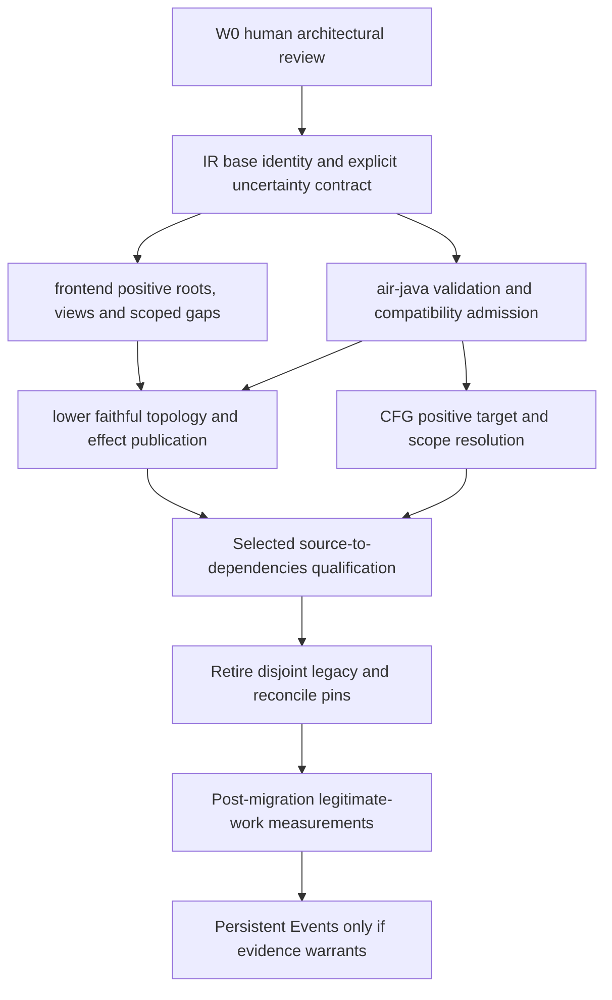

# POSITIVE_MEMORY_TOPOLOGY — W0 discovery

Campaign: **POSITIVE_MEMORY_TOPOLOGY**

Current wave: **W0 — Discovery**

Status: **DRAFT / NO MERGE / READY FOR HUMAN ARCHITECTURAL REVIEW**

Branch: `feat/positive-memory-topology`

Anchor: `analysis-cfg`

Merge policy: **HUMAN MERGE ONLY**

Scope: documentation, current-behavior characterization and isolated neutral diagnostics. W1 is not authorized by this report.

## 1. Executive summary

**Recommend adopting positive memory topology, reusing existing storage identities and bindings.** The current fan-out is a faithful implementation of an explicitly conservative AIR contract, not an isolated solver accident. AIR §03 says different IDs do not establish separation; `StatementEffects.targets` consequently adds whole-base MAY effects wherever `DisjointStorage` is missing. [IR1] [C2]

The smallest sufficient representation for the inspected supported subset is **existing `StorageId` + `Cell`/`Region` + `ViewBinding`/`AliasBinding`/`AlternativesBinding` + explicit scope**. Give distinct storage bases independent state identity; views that share bytes must use the same Region and intersecting ranges. Keep activation context, lifetime, codecs and explicit uncertainty separate. No new Allocation class is justified by the evidence. Unsupported allocation/alias relationships require an explicit producer gap or bounded binding; never silently declare independence for a source relationship that is actually known to overlap. [A1] [F1] [F2] [L1]

New sensitivity runs on the effective baseline reproduced 3,200 targets for 32 regions/100 writes, including 3,100 whose sole reason is `UNPROVEN_BASE_SEPARATION`. A paired valid AIR publication with separation has 100 targets, zero such events, zero compact unknown event rows, and one live encoded edge instead of 63. This is a controlled mechanism experiment, **not a prediction of corporate speedup**. Explicit foreign effects, real choices and partial-copy expansion remain. [W0-PERFORMANCE](W0-PERFORMANCE.md)

Closed-world must govern semantic facts globally, while implementation begins with memory. It must not redefine a consumer's inability to evaluate an expression as proof of a concrete value. Distinguish **published uncertainty**, **consumer interpretation/coverage gaps**, and **extra invented storage effects**. The latter are the primary removal target. No “strict/research” mode or legacy-conservatism switch is proposed.

## 2. Effective baseline, stack and campaign lifecycle

Observed remotely on 2026-09-20. All open product PRs below had successful exact-head Fast CI checks. IR has no open PR and no checks in its recent PR metadata. “Qualified” here means technical checks and recorded qualification, not new human merge approval.

| Repo | Effective base PR | Base branch | Exact SHA | Stack relationship |
| --- | --- | --- | --- | --- |
| proleap-poc | [#56](https://github.com/Gustavo2358/proleap-poc/pull/56) | `feat/source-dependencies-w3` | `edb64520a6269be9fa6d71cd47e6974112fbfece` | #55 Logical Text → #56 Source Dependencies; #57 Dependency Preservation already merged into #56 |
| cobol-lower | [#32](https://github.com/Gustavo2358/cobol-lower/pull/32) | `feat/source-dependencies-w3` | `f8e181f95929c650181c989318f8ba23d1e68a1a` | #31 Logical Text → #32 Source Dependencies; #33 already merged into #32 |
| air-java | [#20](https://github.com/Gustavo2358/air-java/pull/20) | `feat/logical-text-w1` | `646ca3ab1687d43f7d2063fc2a8f3837ab3cf9fa` | Open on main; carries both logical-text transport waves |
| analysis-ir | [#7, merged](https://github.com/Gustavo2358/analysis-ir/pull/7) | `main` | `3fff18e2c16663a3f599207457caa1946d2e0945` | Current remote main, includes file-resource contract; no open stack |
| analysis-cfg | [#43](https://github.com/Gustavo2358/analysis-cfg/pull/43) | `feat/source-dependencies-w3` | `98fa57c3db2edf9f70bb7a99bb667dbf36d28104` | #42 Logical Text → #43 Source Dependencies; #44 already merged into #43 |

The new branch was created at the **exact CFG #43 head**, not local main `3477530`. #42 ancestry was verified. Existing source locks match the four upstream effective SHAs above; **no repin** occurred. The baseline contains dependency-preservation fixes and logical group/overlay handling. The original heads quoted in old PR bodies are historical and are not substituted for current heads.

Only the anchor repo changes in W0. Its permanent campaign PR targets `feat/source-dependencies-w3`, stays DRAFT, and accumulates W1..Wn commits. Open corresponding `feat/positive-memory-topology` PRs in other repos when they actually change, on these qualified tips or on their reconciled actual merges. Do not open a PR per wave. Future parent merges require recorded ancestry/tree comparison and explicit retarget/reconciliation, without silently replacing the baseline, rebuilding the campaign or force-pushing unnecessarily.

E2E evidence repo is local-only and already dirty; its roadmap remains unchanged. Isolated campaign worktree: `.positive-memory-topology/analysis-cfg`. Existing worktrees were not switched/reset/stashed. [W0-EVIDENCE](W0-EVIDENCE.md)

## 3. Current semantic contract — Q3

AIR §03.1 separates logical object, declared storage and contextual location. §03.3/3.1 requires producer-established separation and defines publication-wide pairwise `disjoint_storage`; §03.5 explicitly says nominally different regions need not be physically different. §07 requires materialized producer facts; §06 preserves incomplete coverage and provenance. Those rules currently coexist with “consumer does not complete missing source semantics.” The architectural tension is real. [IR1] [IR2] [IR3]

`StorageIndex.disjoint` checks empty ranges, same-base nonintersection, then common premise membership for different bases. `DisjointStorage(A,B)` and `(B,C)` do **not** establish `(A,C)`. `StorageIndexTest.disjointPremisesAreNotTransitiveAndCodecDoesNotChangePhysicalOverlap` freezes this; `distinctBasesRequirePremiseAndLifetimeQualifiesActivationOnly` freezes the ID rule. These are current-contract oracles, not proof that every source needs cross-base MAY. [C1] [T1]

The declarative premise was introduced in IR commit `a6b771e`; physical target expansion appears in CFG `f80faac` (ST-W2.1). Historical WORK-CFG-028 challenges deliberately reject “storage ID implies disjoint.” That is an intentional conservative design, not accidental missing optimization. A migration must replace those oracles under the new authority, preserve their historical evidence, and retain actual overlap tests.

**A fixture would change:** the three-base nontransitivity case and the two-base no-premise case would become independent under the new contract. Neither publishes a positive A↔C overlap. If possible common storage is intended, publish common-region views, an exact AliasBinding, or AlternativesBinding/UnknownBinding with an explicit bounded scope. Actual same-region overlays already have positive representation and must remain overlapping. No inspected qualified fixture requires *unpublished* cross-base alias as the only way to represent a real overlap; general external/pointer producers have not been qualified and remain a migration risk, not a universal absence claim.

## 4. Proposed closed-world contract

> O analyzer calcula as consequências da AIR. Ele não tenta imaginar semântica que o producer talvez tenha omitido.

Proposed law, subject to W0 review:

1. `StorageId` identifies one declared state base, contextualized for activation lifetime. Distinct declared bases are independent; object IDs alone say nothing about independence.
2. Known shared storage must reuse the same base. View overlap is range intersection on that base. Alias preserves the referenced binding. Choice/Alternatives publishes alternatives; remainder publishes the unenumerated bound.
3. No absent overlap, alias, memory scope or control possibility is added to compensate for hypothetical source omissions. `AllMemory` applies only when explicitly present in an AIR effect/binding/scope that grants it.
4. Unknown value, unknown address and unknown effect are different statements. A literal with an unsupported codec does not create writes to unrelated bases. An unknown offset remains within its published region. A diagnostics scope is not automatically an effect scope.
5. Explicit MAY, Unknown, open outcomes, AllMemory and applicable fallback envelopes remain semantic input. Strong kill still requires an actual required, complete selected write; topology does not convert MAY to MUST. [C7]
6. Missing producer coverage becomes a traceable gap and makes relevant completeness claims partial. It does not grant global havoc. If an instruction cannot be represented honestly, mark the affected operation/query unsupported or partial; do not treat the unsupported operation as a complete no-op.
7. Consumer interpretation limitations are reported separately from model possibilities. If exact semantic interpretation is required but unavailable, reject that analysis/profile or return an incomplete interpretation; do not manufacture concrete successors, aliases or names.

This is a proposed replacement contract, **not the meaning of existing AIR snapshots**. Consumers must continue honoring explicit broad input during migration.

## 5. Current memory topology — Q2

| Concept | Meaning established by implementation | Allocation relationship |
| --- | --- | --- |
| `Memory.Cell` | One abstract typed value; no byte extent | State slot; not necessarily one physical source declaration. Logical lowering also uses root/projection cells |
| `Memory.Region` | Byte sequence with known extent or explicit `extentUnknown` | Often one proved source storage component; current AIR does not guarantee distinct Region IDs imply disjointness |
| `StorageIndex.Location.base` | Existing `StorageHeader` of Cell or Region | Not a new allocation object; header carries StorageId, optional Unit owner, lifetime, visibility, origin |
| `ObjectDeclaration` | Nominal declaration + binding | Several objects can name the same location; distinct object IDs never imply independence |
| `ViewBinding` | Region + constant byte offset/extent + codec | Same region, intersecting half-open intervals means shared bytes |
| `AliasBinding` | Resolves referenced object binding | Exact same view/location, not an arbitrary overlap |
| `AlternativesBinding` / `Places.Choice` | Enumerated locations plus explicit remainder | Preserve all alternatives, even when bases are independent |
| `RegionSlice` | Region plus evaluated offset/length | Current resolver handles constants precisely; calculated bounds open only the region before secondary target amplification |
| `owner` | Unit ownership for visibility/lifetime | One Unit owns many independent variables; it is **not** allocation identity |
| activation | Location contextualized with EntryId; persistent/external without that activation suffix | Must preserve context abstraction; IDs alone must not merge activations |

Evidence: model [A1]; `StorageIndex` binding/resolve/whole/contextualization [C1]; fixture exact alias and adjacent ranges [T1].

Frontend `StorageComponents.components` collects a contiguous proved REDEFINES sibling component. `StorageLayoutSemantics` chooses the root component representative as base; descendants share that base, member overlays share the start, and group child offsets advance by component footprint. Extent uses supported shapes; unknown layout does not fabricate offsets. Thus a base is not “one declaration”: it can cover several redefinitions and all group descendants. RENAMES has no new allocation; proved endpoints create a view of its owning root. File record components also share source storage where positively established. [F1] [F2] [F3] [F5]

Lower `RegionalDataTranslator` maps each published source BaseId once to a StorageId. A standalone admitted scalar may represent that component as a Cell without a duplicate Region; precise physical objects use ViewBinding. It skips an unproved base with unknown extent, records `STORAGE_ALLOCATION_UNAVAILABLE`, and creates bounded or global UnknownBinding for remaining objects. Thus not every SP base currently becomes a Region. Proven allocation controls PRIVATE vs UNKNOWN visibility; Unit owner still does not separate allocations. [L1]

## 6. Source → product → lower → AIR → analyzer → output

```text
COBOL declarations / operations
  StorageComponents (root allocation, overlays, scoped uncertainty)
  StorageLayoutSemantics / StorageRenames (bases, ranges, views)
  StatementEffectSummary / file and CICS effect facts
    ↓ explicit SP storage, logicalTextViews, move/access/effect facts, coverage
RegionalStorageAdmission / RegionalDataTranslator / StoragePremise
LogicalTextIndex / LogicalTextMove; operation-specific handlers
    ↓ Memory.Cell/Region, bindings, Assign/CopyBytes/Invoke/Opaque, scopes
AIR model + validator + JSON binding
    ↓ admitted immutable Publication / CFG / AnalysisSession
StorageIndex → StatementEffects → StoragePartition / RD
    ↓ prepared physical or logical plans, events, correlation groups
RegionalValuesAnalysis.Engine.apply / existing PossibleValues
    ↓ stable result + replay / BEFORE observation + detached supports
CallDependencyPlan / CallDependencyConsumer; FILE/CICS consumers
    ↓ candidates, model/source/interpretation remainders, provenance
dependencies.json (baseline 2.5.0); source dependencies join separately
```

The language-specific facts stay in frontend; lower validates/translates published facts and builds neutral expressions. The proposed consumer needs no COBOL recognition. Logical group projections are operational AIR assignments, not covert physical aliases. Source COPYBOOK/DCLGEN/DB2_TABLE dependencies do not use regional writes and must remain unaffected. [F1] [F2] [L1] [L3] [C1] [C2] [C3] [C10] [C11]

### 6.1 Logical route compared with physical — Q8

The operational default is logical-only. `LogicalTextIndex` validates frontend-published **character** coordinates; `LogicalTextMove` builds `Read/FitText/SliceText/Concat`, updates an authoritative root Cell and assigns projections to related view Cells. REDEFINES and RENAMES participate in the published root family. Source snapshot reads occur before the root update; branch alternatives of the whole root preserve within-family correlation. These assignments explicitly state the relationships; the consumer does not rediscover COBOL layout. [L3] [L4] [D1]

`TextProfile` uses direct Cell identities and backwards demand closure over expression reads. It prepares only demanded cells and their source closure, but still requires a covering DisjointStorage premise today. The broader regional provider in LOGICAL_ONLY compiles only explicit logical named targets and same-Cell bindings; physical bases/plans are disabled. It can still pay StatementEffects preparation cost when that provider is selected, so “no physical apply” does not universally mean “no preparation fan-out.” The common admitted scalar route avoids that preparation. [C5] [C3] [C10]

| Property | Logical operational route | Physical route |
| --- | --- | --- |
| Coordinates | Source-proved text characters and pure expressions | Region bytes, codecs and intervals |
| Aliasing/group update | Explicit root/projection Assign operations | Positive same-region overlap plus current absence-proof fan-out |
| Alternatives | Whole-root scalar candidates, supports and unknown remainder | Segment/correlation relations, byte fragments, captured provenance |
| Work bound | Demand closure for supported scalar profile | All prepared physical targets; per-group projection/replay |
| Reusable idea | One authoritative root, explicit relationships, demand before detailed state | Reuse base/range topology; retain byte-copy/codec behavior |

Prior logical W2 scale at 10/100/1000 irrelevant families retained 5 detailed Cells, 6 writes and 6 producers, with zero physical plans/groups/writes in that selected route. Parsing/serialization/CFG/heap still grew; 10,000 was not measured for analysis because upstream serialization failed. This is **reused evidence**, not a new W0 timing run. Physical topology is not replaced by text coordinates: byte codecs, partial copies, unknown extents and general physical views remain fundamentally different. The scalar disjointness admission must still migrate; logical-only is not already a complete closed-world implementation. [D1]

## 7. Conservative-mechanism inventory — Q6/Q7

Classification: **A** explicitly published uncertainty; **B** consumer amplification from absence of proof; **C** positive producer information; **D** producer gap currently compensated. A/D can coexist: a gap can lead the producer to publish a broad effect, which the current consumer must honor. “Published?” asks about the **extra behavior**, not whether any input field exists.

| Mechanism / code | Class | Extra possibility positively published? | Disposition |
| --- | --- | --- | --- |
| Other-base MAY in `targets`, lines 113–120 and 134–137 | B/D | No specific overlap/effect; licensed by current default AIR rule | REMOVE after contract/producer migration |
| Revisited remainder scope → every base, `UNRESOLVED_SCOPE`, C2:126–128 | B/D | No global scope required | REPLACE with fixed-point scope resolution within declared bound, or explicit unsupported resolution |
| `openObjects` → all open logical targets, C2:44,156–159 | B/D | Individual open bindings exist; blanket reachability from every write is not checked here | REPLACE with binding/scope reachability; do not blanket delete real open aliases |
| `UnknownBinding`, `Choice`, `AlternativesBinding.remainder` | A/C | Yes | KEEP, normalize closure and bounds |
| Unknown Region extent makes exact view resolution open within base, C1:184–196 | A plus consumer approximation | Unknown extent yes; extra location remainder comes from resolver precision policy | REPLACE overly broad interpretation with bounded validity/coverage; requires adversarial tests |
| Nonliteral calculated slice → within(region), C1:191–207 | A/interpretation limit | Region/expression yes; exact evaluated intervals not computed | KEEP bound; improve evaluator separately, never all bases |
| Unproved operation precondition downgrades write to MAY, C2:152 | B/validation-limit | Not necessarily an explicit MAY; derives from validator's unproved set | REPLACE admission/coverage policy, investigate individually; no blanket MUST conversion |
| Explicit HavocMay, foreign writes, Opaque otherWrites | A | Yes | KEEP MAY_SET and bounds |
| Explicit HavocMust / returned result / mustOverwrite | A/C | Required write yes; returned value unknown | KEEP location and overwrite authority |
| `CopyBytes` nonexact input uses its AIR fallback memory, C2:64–72 | A | Fallback explicitly present; its applicability is a consumer decision | KEEP envelope; no invented wider fallback |
| Unspecified entry content → `UNSPECIFIED_ENTRY_CONTENT`, C3:254 | Contract default / missing initial-value knowledge | Not explicit InitialCondition; current AIR forbids implicit zero | KEEP honest unknown content or require explicit open EntryState in new contract; never creates alias |
| Unsupported codec/literal/expression → interpretation unknown, C3:465–512 | Consumer capability gap | No new program behavior asserted; interpretation unavailable | KEEP gap status; distinguish from model remainder; do not claim concrete values |
| Operation/object precision gaps propagated via `sourceGaps` through `effects.targets`, C3:108–121 | A + B amplification | Gap explicit, cross-base reach not explicit | REPLACE reach with positive topology; retain gap on actual affected subject |
| No writes + open storage/value/effects marks unit `controlOpen`, C3:110 | B/coverage conflation | Control possibility not necessarily asserted | NEEDS_MORE_EVIDENCE; separate completeness dimensions; do not rewrite CFG in W0 |
| Partial control/unproved precondition widens unit completeness, RD and C3 | A plus B granularity | Partial coverage explicit; semantic successors only from CFG/envelopes | KEEP partial status, audit unit-wide propagation |
| Unknown Invoke edge applies otherwise and every known outcome with forceMay, C3:524–525 | A + consumer approximation | Open outcome yes; each bound published | KEEP conservative union until outcome applicability is refined |
| CFG known control projection | C/A | Known successors and remainders explicitly published | KEEP; no textual fallthrough or invented CALL destination |
| Scalar AllMemory/VisibleMemory selection, C8/C9 | A | Yes | KEEP; foreign profile may refuse unsupported shapes rather than infer them |
| Scalar profile demands one disjoint premise covering all admitted cells, C5:56–66 | B admission requirement | Absence refuses optimized profile, not direct new alias | REPLACE with base identity semantics; removes unnecessary fallback admission |
| Dependency interpretation/resource resolution remainder | A/consumer knowledge limit | Candidate sources remain explicit; interpretation or external catalog can be unresolved | KEEP known candidates and separate remainders; no speculative resource names |

Concrete code and current behavior are linked in [source index](W0-EVIDENCE.md). This inventories the searched mechanisms, not a proof of exhaustive semantic support for every language or extension.

## 8. Classification and contract boundary

A broad effect can be legitimate **as published AIR** while its frontend origin deserves narrowing. Do not erase AllMemory in the consumer merely because it originated in a missing layout or unsupported statement. First repair the producer's claim; then the consumer follows the repaired AIR. Conversely, no published source gap grants the consumer license to enlarge a scope independently.

Positive facts include source root components, proved relation endpoints, logical coordinates, view ranges, codecs, typed effects, exact destinations and occurrence/outcome strength. Negative separation premises currently encode some of those facts indirectly. Generic MAY/Unknown should survive when someone actually asserted the possibility. An operational “cannot interpret” result remains necessary even in closed-world semantics; the answer may be incomplete without the semantic model growing.

This distinction also protects Dependency Preservation: a known candidate plus a gap remains a known candidate plus an open completeness claim. A frontend gap is not proof of overwrite, unreachable control, or closure. [D3] [C7]

## 9. Detailed UNPROVEN_BASE_SEPARATION trace — Q1

1. **Producer proof source:** frontend allocation/component analysis decides what can be represented and marked allocation-proved. `RegionalDataTranslator.premises` collects proved source roots and admitted logical leaves; `StoragePremise.translate` transports scalar disjoint evidence. They construct `Proofs.DisjointStorage`. Missing proof means no such guarantee, not a positive alias fact. [F1] [F2] [L1] [L2]
2. **Wire/model:** `Proofs.DisjointStorage` is an AIR assertion, serialized/read as `disjoint_storage`; validator checks references and entry consistency. It does not independently prove the source language allocation. [A2] [A3] [A4]
3. **Preparation:** `RegionalValuesAnalysis.prepare(session, mode)` → `new StorageIndex(session)` → `new StatementEffects(storage)` → per-operation `prepare` → `Builder.write` → `targets(destination,strength)`. [C3] [C2]
4. **Ask/interpret proof:** `StorageIndex` indexes premise membership by base (C1:42–43). `separationPremises(a,b)` intersects memberships; `disjoint(a,b)` returns false for distinct bases without shared proof (212–220).
5. **Create targets:** C2:113–120 scans every other base. Missing disjoint → `Target(whole(other), MAY, false, [], [UNPROVEN_BASE_SEPARATION])`. Direct target remains requested MUST iff resolution exact, with `sourceApplicable=true`. Remainder candidates repeat the expansion at 134–137. Precondition downgrade occurs independently at 152.
6. **Register Events:** C3 `compile` (184–195) creates one event ordinal and `PreparedEvent` per physical target when physical mode is selected. This happens before solver iteration; visits do not create infinitely new producer identities. RD independently uses the same prepared effects; `DefinitionEvent.write` flags unknown when source is unknown or `sourceApplicable=false`, retaining reason/storage/operation/slot/outcome. [C6]
7. **Transfer:** `Engine.apply` groups targets by correlation group/write; projects and enumerates source selections; `write` weakly unions non-source-applicable targets; `replacements` at 435 returns `unknown(target,"UNPROVEN_WRITE_DESTINATION",event)`. Unknown bytes carry that event. Literal bytes are never copied into a speculative target. [C3]
8. **Relations/history:** `RegionalAlternatives` factors compatible full-image unknowns by shape/child while preserving exact Events; immutable array unions and interning retain historical event sets. Factoring reduces structural edges, not target count or provenance. [C4]
9. **Observation/output:** `Execution.observeStorage` replays to the query point; fragment construction recovers unknownWriter/captures/DefinitionEvent. `CallDependencyPlan` requests BEFORE Invoke; consumers retain candidate supports and model/source/interpretation remainder in dependencies. Thus the extra target creates work and uncertainty even when it never creates a literal resource name. [C3] [C10] [C11]

```text
absent separation premise
  → scan other bases → MAY target, sourceApplicable=false
  → prepared per-target Event → unknown byte image
  → weak union preserves old + unknown alternatives
  → compact shape + larger immutable Events history
  → projections/selections/joins/replay
  → detached unknown evidence and open dependency observations
```

## 10. Detailed AllMemory / MemoryScope trace — Q6

Complete lower constructor-site inventory is in [W0-EVIDENCE](W0-EVIDENCE.md#exhaustive-constructor-site-scan-at-the-inspected-lowering-boundary). Every listed lower site **does publish** its resulting scope in AIR. Distinguish these paths:

| Producer path | Why broad today | Consumer path / what to preserve |
| --- | --- | --- |
| `InvokeHandler` CALL | Signature only partially modeled; reads/writes AllMemory; outcomes open, local return separately published | StatementEffects foreign bounds → MAY_SET; BEFORE target observation occurs before these effects |
| `CicsInvokeHandler` LINK/XCTL | Signature/foreign effects unknown; AllMemory reads/writes | Same; XCTL must not gain normal return |
| `RegionalDataTranslator` unsupported object | No materialized base → UnknownBinding(AllMemory including environment); known base → StorageMemory | StorageIndex binding → explicit remainder; topology may narrow producer publication later |
| `OpaqueOperands.memory` | Missing typed effect summary, unknown bounds/exposures, or operand materialization mismatch | Opaque envelope known reads/writes and otherWrites remain distinct; a missing address does not justify invented literal targets |
| `EvaluateLowerer`, unknown CALL/CICS target expressions, conditional GOTO | Unknown reads can use AllMemory | Read dependencies only; not automatically global writes |
| `FileMemoryLowering`, `FileResourceLowering`, `FileSortLowering` | VisibleMemory for unknown/absent plan, unresolved target or procedure endpoint | Preserve explicit visible effect/control bounds; precise known objects already use ObjectsMemory |
| `CicsFileMemory` / `CicsFileInvokeHandler` | Unsupported option/unknown width/materialization can widen to VisibleMemory | Precise option regions remain bounded; unknown variants keep published bound until producer refinement |
| `FileAuxiliaryLowering` checkpoint | Broad visible reads with NoMemory writes | Do not convert read uncertainty to a write |

`StorageIndex.select`: ObjectsMemory resolves those objects; StorageMemory enumerates those bases; MemoryUnion unions; VisibleMemory includes owned/visible objects and selected external/shared bases; AllMemory enumerates published bases. `includingEnvironment=true` additionally retains external remainder (`ENVIRONMENT_STORAGE`). [C1] (lines 222–241)

`Builder.scopeWrite` makes a MAY_SET with UnknownSource; `foreign` and `envelope` invoke it only on a WithinMemory writes bound. Thus explicit AllMemory legitimately affects the declared scope. **However**, `targets` then enlarges even a narrow explicit scope to other bases through missing separation, and its visited-scope fallback can select all bases. Removing these consumer amplifications is separate from honoring the input scope. [C2]

## 11. Minimum sufficient positive representation — Q4

| Option | Expresses shared memory and independence? | Cost / decision |
| --- | --- | --- |
| A. Keep Region, change base semantics | Yes, if distinct StorageIds are independent and shared views use one Region; extend same law to Cell state slots | **RECOMMENDED**, with contract and producer obligations |
| B. Add AllocationId/StorageIdentity | Yes, potentially useful if multiple separate Regions must share an allocation with coordinate transforms | Extra model/codec/validator/identity layer; no qualified fixture requires it. **Do not introduce now** |
| C. Existing root/storage owner | SP root component is suitable producer allocation evidence; AIR Unit owner is not | Reuse SP base mapping; never use UnitId as memory identity |
| D. ViewBinding + range only | Already expresses overlap **within** a Region | Necessary but insufficient without cross-base identity law |
| E. Existing Cell/Alias/Alternatives/UnknownBinding scopes | Handles scalar exact aliases and explicitly possible/open locations | Combine with A+D; no new structure required for covered subset |

Minimal statement: **“estas views pertencem à mesma memória” = same storage base; “estas outras pertencem a memórias independentes” = different storage bases.** Range is meaningful only within a Region. Same `[0,8)` on different regions is not overlap. Ownership/lifetime/context remain separate, and unknown physical coordinates must not be confused with unknown allocation identity.

Current model can publish unknown alias within one known root without a new Allocation: UnknownBinding(StorageMemory(root)) or explicit alternatives. An unknown relationship among a finite set of roots can explicitly select that set. For external storage with truly unknown universe, an explicit broad bound is meaningful. For *unimplemented* identity publication, use coverage/unsupported status; do not promote a fresh nominal ID to proven physical allocation merely to proceed.

## 12. Candidate obsolete structures and fields — Q5

| Component | Current purpose | Future | Decision / confidence |
| --- | --- | --- | --- |
| `Proofs.DisjointStorage` / `disjoint_storage` wire assertion | Negative universal pairwise guarantee | Distinct base identity law + positive binding facts | REMOVE after synchronized migration / high |
| `StorageIndex.separation`, membership intersection, `separationPremises` | Proof lookup for different bases | Direct identity/range comparison | REMOVE / high |
| Frontend separation proof records / `StoragePremise` / `RegionalDataTranslator.premises` disjoint output | Convey allocation independence | Publish trustworthy root identity and explicit relationships | REPLACE; retain positive allocation/provenance assessment / high |
| `UNPROVEN_BASE_SEPARATION` targets, loops, reasons | Cross-base MAY from no proof | No cross-base effect absent positive relation/scope | REMOVE / high |
| `UNPROVEN_WRITE_DESTINATION` | Unknown replacement for nonapplicable target | Still needed for explicitly open destinations; split causal reason | REPLACE, not global string deletion / high |
| `UNRESOLVED_SCOPE` all-base fallback | Terminate cyclic/repeated scope expansion conservatively | Bounded closure or unsupported-resolution result | REPLACE / high |
| `TextProfile` disjointness admission | Require common covering premise | Independent Cell state identities | REPLACE / high |
| AIR entry checks requiring cross-base separation | Validate possible simultaneous entry facts | Identity + same-base overlap checks | REPLACE; preserve I-17 contradictions / high |
| `premiseMemberships`, base-separation diagnostics | Work/precision counters | Retire or document obsolete metric; keep structural counts meaningful | REMOVE/REPLACE / high |
| `baseComparisons`, `targetsPrepared`, events metrics | Observe work | Keep meaningful counts; add reason attribution if needed | KEEP, redefine only explicitly / medium |
| ID-is-not-disjoint fixtures / historical challenge artifacts | Current normative oracle | Replace current expectations; preserve history as CURRENT_BEHAVIOR | REPLACE / high |
| General Premise / SameDomain / evidence refs | Type, source, entry and proof provenance | Still required; topology does not establish type/codec | KEEP / high |
| Region/ViewBinding/StorageRange/partition | Physical topology | Core of positive representation | KEEP / high |
| KillAuthority and MUST/MAY distinction | Prevent unjustified kills | Unchanged law, simpler reachability inputs | KEEP / high |
| Scope/Choice/Unknown/AllMemory and explicit envelopes | Positive incompleteness | Retain semantics | KEEP / high |
| Correlation groups, compact relations, Events, replay | Real choices and provenance | Still needed; less artificial input | KEEP pending post-migration profile / high |
| Unknown extent/precondition/coverage widening outside storage | Approximation/admission concerns | Separate interpretation from model effects | NEEDS_MORE_EVIDENCE on each policy / medium |

The current premise index is **not an explicit N² matrix**: a single disjoint group uses O(N) memberships. The demonstrated repeated work is destination × other bases and downstream state/history, even with singleton groups. Do not justify migration with a nonexistent materialized all-pairs structure. [C1] [T1] [T2]

## 13. Existing fixtures and proposed acceptance oracles

All W0 executions retain **CURRENT_BEHAVIOR**. The future expectations below are designs, not newly passing semantics.

| Oracle | Existing witness / regression family | Required new-contract assertion |
| --- | --- | --- |
| T1 trivial independence | RegionalExplosionFixturesTest, StorageIndexTest; source elementary MOVE fixtures | Without disjoint premise: A write yields no B target/event/unknown; check supports, not only count |
| T2 positive REDEFINES | frontend StorageOverlayTest/ProductTest; lower OverlayStorageIntegrationSuite; regional overlap tests | Shared base prefix changes intersecting whole view; independent suffix unchanged; no unrelated-base effect |
| T3 group MOVE | StorageLayoutTest, lower LogicalTextStorageSuite, logical-text-w2 group/partitions | Affect exactly same-root pertinent views; padding/truncation explicit; preserve copy snapshot |
| T4 equal numeric ranges across allocations | StorageIndexTest two-base fixture | A[0,8) and B[0,8) independent without premise; same-base intersection remains overlap |
| T5 explicit AllMemory | ConservativeEffectTransfer/foreign tests, mixed storage, file/CICS effect tests | Every allocation admitted by explicit scope receives MAY; preserve environment remainder |
| T6 no AllMemory | Pair T1 with UnknownBinding scoped to one root; scope-cycle adversarial | No extra base from missing proof, missing metadata or repeated scope; read-only unknown adds no writes |
| T7 real IF alternatives | logical-text-w2 overlay-branch/correlation; RegionalCompositionTest.branchHalvesStayInTheirOriginalImage | PROGA and PROGB both survive join; no cross-branch fabricated combination or deleted alternative |
| T8 unsupported frontend construct | PartialWriteEffectsTest, StorageProjectionFallbackTest, PartialIntegrationSuite | Explicit diagnostic/coverage, preserve independent known evidence, no automatic global havoc; refuse affected complete answer if necessary |
| T9 dependencies | source-dependencies-w3 DB2/COPY matrix; logical-text-w2; file/CICS and DependencyPreservation tests | COPYBOOK/DCLGEN/SQL_INCLUDE/DB2_TABLE/FILE/CALL/CICS candidates, supports, BEFORE timing and remainders preserved except reviewed semantic deltas |
| T10 deterministic E2E | Existing CLI runners; typed RegionalSemanticSnapshot | Run selected source cases twice; compare actual dependency JSON/provenance/supports and declared deltas, not output existence |

Additional mandatory adversaries: exact alias vs overlapping unequal view; unknown offset bounded to root; unknown extent; two explicit alternative destinations; partial-copy source snapshot; two activations of one base; external shared binding; two roots with one unsupported declaration; unknown outcome with per-outcome effects; empty range; codec mismatch; known candidate plus open remainder; missing operand materialization. Never mutate a baseline to obtain PASS.

## 14. Producer coverage gaps and transferred obligations — Q12

| Construction | Before / current compensation | After / producer obligation | Existing evidence / gap |
| --- | --- | --- | --- |
| Normal local allocation | Separation premise may be withheld, triggering global cross-base MAY | Publish independent source base identity; mapping preserves it | StorageComponents, Layout, RegionalDataTranslator already map roots |
| Group | Physical base/ranges or operational logical root/projections | Publish same-root views; do not allocate each child independently | Fixed textual supported; other layouts can remain coverage gaps |
| REDEFINES | Proved siblings share base; unproved root relation can open unit allocation | Publish shared root/ranges or bounded uncertain relationship; no invented independent overlay | Existing physical/logical tests; unknown offsets must not be aliased exactly |
| RENAMES | Proved interval on root; unproved endpoints retain root gap | No new allocation; exact span or bounded same-root uncertainty | StorageRenames + RenamesStorageSuite |
| Exact alias | AliasBinding; open objects can receive blanket effects | Reuse binding/Cell or explicit alias; scope-index uncertain aliases | General pointer analysis not implemented/qualified |
| Slice / reference modification | Calculated bound opens region, then may fan out globally | Publish base and expression; keep uncertainty confined to that root | Constant/selected fixed slices supported; dynamic evaluation limited |
| LINKAGE/reference parameter | No general qualified storage binding; broad unknown semantics | Publish association to caller state/alternatives/explicit external scope when supported; otherwise gap | New interprocedural engine is outside this campaign |
| External/shared storage | Nonlocal visibility may invalidate allocation proof for unit | Canonical shared identity or explicit scope; distinguish environment from declared state | General external identity agreement needs a contract oracle |
| Computed ranges/OCCURS/ODO | Unknown layout/range conservatism | Base identity independent of coordinate precision; explicit allowed bounds; unsupported capability remains visible | General dynamic layout not qualified |
| Broad foreign effects | CALL/CICS publish AllMemory, Opaque may infer it from gaps | Publish broad effect only as deliberate source/foreign-contract abstraction; keep it if justified | No request to solve every external CALL body |
| Missing COPY / preserved clause / input gap | Unit allocation proof can vanish | Coverage tells which facts are incomplete; independent facts remain usable | Must not claim whole-source completeness |
| Unknown statement effect | Missing summary/materialization widens Opaque to AllMemory | Transport typed effect bounds or report affected query unsupported/partial | `OpaqueOperands` mismatch/exposure paths need producer work |

For PL/I, HLASM, Java and future languages, the **same AIR obligations** apply: canonical state bases, explicit shared views/aliases/alternatives, lifetimes and effects. No frontend implementation for these languages was present in the investigated repos; source-specific conformance is NOT_QUALIFIED. Java-style references or dynamic HLASM addressing cannot be declared independent by merely generating distinct IDs.

Preferred unsupported policy is coverage/diagnostic, preserving independent facts and refusing unsupported completeness, **not** automatic all-memory havoc. Current `SemanticCoverage`, SP effect bound/gap records and AIR CoverageItem/Uncertainty/Precision already transport gaps. Current consumers sometimes turn these into unit/global semantic work; the migration must separate diagnostic scope from effect scope. A partial operation must not quietly become a no-op or leave stale values labeled exact.

## 15. Sensitivity and performance evidence — Q9

New measurements and reproduction: [W0-PERFORMANCE](W0-PERFORMANCE.md). Exact production baseline, Java 21, existing synthetic AIR probe and real physical solver. The paired control adds one valid DisjointStorage premise; production code is unchanged. This is a sensitivity proxy for removing only the absent-proof cross-base targets, not implementation of new semantics.

| Regions / writers | Prepared targets → separated | UNPROVEN → separated | Live compact event rows → separated | Historical compact event rows → separated | Encoded / expanded live edges → separated |
| --- | ---: | ---: | ---: | ---: | --- |
| 4 / 5 | 20 → 5 | 15 → 0 | 15 → 0 | 60 → 0 | 7 / 19 → 1 / 1 |
| 16 / 50 | 800 → 50 | 750 → 0 | 750 → 0 | 19,875 → 0 | 31 / 766 → 1 / 1 |
| 32 / 100 | 3,200 → 100 | 3,100 → 0 | 3,100 → 0 | 159,650 → 0 | 63 / 3,132 → 1 / 1 |

Groups remain N singleton groups; topology removal does not magically merge/split the schema. Materialized active group work shrinks. At 32/100, relation union pairs 3,100→0; projected solve selections 3,200→100; concrete fallback calls remain 100→100. Full-image unknowns attributed to the cross-base writers disappear; untouched entry unknowns remain implicit. Thus target/event amplification is removed, but not all representation work.

No new corporate execution, full source corpus, peak RSS, retained-heap study or production SLA. Prior corporate non-convergence remains **UNRESOLVED**; exact config/hash/counters were not retained in the prior closeout. Historical synthetic factorization evidence is supporting context; W0 counts above are newly executed. Logical source E2E/scale evidence in [D1] is reused, not relabeled as W0 source execution.

## 16. What positive topology probably eliminates

For the measured class: per-write enumeration of unrelated bases, UNPROVEN-only targets and prepared events, their unknown labels, weak unions, compact event rows/history, and subsequent projection/replay of those alternatives. Removing obsolete disjoint proof preparation/admission also simplifies the scalar and validation paths.

This does **not** imply all sources will gain equally: an explicit AllMemory foreign write remains broad; an UnknownBinding(AllMemory) still selects all bases until the producer changes it. The default dependency route is already logical-only, so physical-engine sensitivity is not a claim of equal speedup in default CLI runs. Source gaps and legitimate open output do not vanish merely because artificial interference does.

## 17. Legitimate remaining growth — Q10/Q11

- Published Choice, open remainder, unknown initial contents, real branch joins and explicit MAY_SET retain alternatives. K dimensions needed by actual read/write correlation remain; topology cannot delete them.
- Same-root partial writes/copies can fragment byte images, capture earlier values and force concrete fallback. Explicit cross-root copies can connect correlation groups even when allocations are independent.
- `RegionalAlternatives.union` can compare a×b edges for overlap/fallback; project/restrict/selections can expand the exact requested relation. Output/provenance size can itself be large. No hidden cap/pruning/widening is proposed.
- Finite prepared Events are different from historical immutable `Events` sets. Successive legitimate weak writes still create prefix sets; `Events.union` copies arrays and the interner retains prior nodes until Engine lifetime ends. This remains potentially quadratic in writers per compact group. [C4]
- Unknown outcomes can execute multiple published effect sets in approximation; foreign AllMemory still scales with allocations. Query replay and detachment can cost more than solve metrics alone.

**Persistent Events priority:** do **not** start it ahead of topology. In the three fan-out witnesses all live/history compact rows disappear while 5/50/100 direct overwrite events remain. Their surviving per-group live content is a singleton, and no event-array growth remains there. This does not establish typical corpus event-set size: real workload distributions are **NOT_MEASURED**. Keep persistent Events as a conditional follow-up only if post-migration metrics show material legitimate prefix-set histories; do not reserve an unconditional wave now. Existing factorization remains valuable for explicit unknown writers and cannot simply be removed.

## 18. Semantic migration risks

1. Legacy AIR may use different bases for storage whose relation was intentionally unknown. Reinterpreting that snapshot as independent without producer reconciliation is unsound relative to the old contract.
2. Treating owner Unit as allocation would collapse independent roots; treating every source declaration as allocation would split groups/overlays. Both are rejected.
3. Gaps cannot become fabricated independent storage, implicit zero, empty target set, exact no-op, or unjustified kill. Known candidates plus incomplete evidence must survive.
4. Logical Cells can be state projections updated by explicit assignments; they are not proof of physical source byte allocation. Do not impose byte aliasing on their operational model.
5. Scope-cycle termination must respect the supplied bound without dropping explicit environment remainder. Empty scopes, union duplicates and recursive object bindings need specific tests.
6. Removing disjoint premises changes support/premise provenance and possibly serialized observables. Declare intentional differences rather than requiring false byte equality against the old physical results.
7. No source language knowledge may migrate into analysis-cfg. Cross-repo pins and old-reader refusal/compatibility must be demonstrated at every changed boundary.

## 19. Compatibility, wire and versioning

W0 changes **no** AIR/SP/CFG/dependency wire, model, production class, pin or output rule. Baseline AIR is 2.0.0, AIR JSON binding 1.0.0; SP is 2.32.0, dependencies 2.5.0. Historical version fields in the lock are contextual; exact source SHAs are authoritative.

The smallest final topology need not add a field, but changing StorageId semantics and removing `disjoint_storage` is a **semantic incompatibility**. Existing JSON readers accept only known variants/fields; model/codec inventories and validator tests must migrate with the normative definition. [A4]

Local CFG pre-release policy favors in-place correction and forbids legacy modes for unpublished behavior. It expressly does not authorize unilateral AIR changes and allows cross-repo wire revisions to reject incompatible snapshots. IR §09 likewise treats working-snapshot reconciliation explicitly. [D4] [IR4]

Proposed W1 decision: revise normative semantics and producer/consumer pins together; decide whether existing strict snapshot negotiation sufficiently prevents old-publication reinterpretation. If serialized AIR can arrive independently of pins, use a contract/capability revision or explicit incompatibility rejection. That is protocol negotiation, **not an optional semantic mode**. Do not invent a new local analysis profile merely to keep UNPROVEN behavior; do not assert wire compatibility because the JSON happens to parse. Exact version token is intentionally left to W1 contract review, before implementation ships.

## 20. Implementation dependency graph



The graph expresses dependencies, not six isolated horizontal implementation waves. Contract/producer/consumer changes must meet in a working vertical slice before a wave claims qualification. Source-independent manual AIR tests can develop before producer completion; source E2E claims cannot.

## 21. Proposed waves after discovery

The evidence supports **three implementation waves**, with an optional later performance investigation only if warranted. They continue the same campaign PR per repo.

| Wave | Thesis and observable result | Repos / qualification boundary |
| --- | --- | --- |
| W1 — Positive identity vertical | Freeze reviewed AIR identity/compatibility law; publish and consume independent elementary roots and positive shared group/REDEFINES/RENAMES views. Remove absence-only cross-base expansion and scalar separation admission as part of this slice. T1–T4, T7 pass through real source and manual AIR; no legacy-mode switch | analysis-ir + air-java + frontend/lower where publication/admission changes + analysis-cfg; focused model/codec/producer/consumer tests, selected E2E and changed-repo FAST |
| W2 — Explicit uncertainty and effects | Bounded aliases/slices, scope closure, unsupported-source gap policy, entry/precondition interpretation and foreign effects. T5/T6/T8, missing-layout/external/unknown-outcome adversaries. Retire obsolete disjoint assertions/indices/metrics/fixtures with no positive-effect loss | Same affected boundaries; do not implement general LINKAGE/pointer analysis. Unsupported constructs remain explicit coverage; full removal requires no remaining unqualified legacy producer path |
| W3 — Dependency and operational qualification | T9/T10 across existing qualified dependency families, deterministic outputs and reviewed provenance changes; measure target attribution, live/history Events, selections/replay/fallbacks on representative corpus/cohort. Reconcile parent merges/pins and document performance limits | analysis-cfg + local E2E harness, producers only for demonstrated regressions; selected regression matrices first, broader corpus when measuring representativeness |

No preliminary standalone “contract-only” release claiming finished semantics; W1 ends with product-observable independence and actual overlap. W2 closes the hard incomplete-publication frontier instead of a giant catch-all refactor in W1. W3 validates regression/performance rather than inventing new semantics. Human wave review remains the continuation point; all campaign PRs stay DRAFT until explicit authorization.

## 22. Campaign acceptance criteria

- AIR contract, producer topology and consumer target selection agree; missing negative premise never creates a new positive effect.
- T1–T10 and the adversaries in §13 pass with independent oracles. Real explicit MAY/Unknown/Choice/AllMemory/outcomes retain their possibilities and bounds.
- No unsupported source construction silently becomes complete no-op, independent physical allocation or global havoc. Coverage and interpretation limits are visible and attributed.
- Existing supported dependency kinds preserve known candidates, provenance, support timing and honest remainders; intentional physical/provenance changes are enumerated and reviewed.
- Determinism is tested on actual source→SP→AIR→CFG→dependencies products, not just scalar counts.
- Structural metrics show elimination of absence-only targets/events. Performance claims state population, mode, inputs, stage failures, repetitions and measurement scope. Corporate incident closure requires actual evidence, not these synthetic results.
- No legacy conservative switch, second source-language engine in CFG, guessed frontend facts, lossy event truncation, or weakened gate.
- Exact cross-repo SHAs/compatibility recorded; applicable FAST and boundary tests pass; campaign PRs remain DRAFT/no merge until human authorization.

## 23. Open questions / explicit limits

1. What compatibility rejection mechanism will prevent independent old AIR files from acquiring the new identity meaning? Resolve before W1 output is consumed.
2. For unsupported external/LINKAGE identity, can existing bounded UnknownBinding and coverage express enough without model changes? Covered local layouts say yes; general pointer/reference producers are unqualified.
3. Should unknown Region extent permit exact declared subview location while separately flagging bounds validity? Current resolver conflates these; needs an oracle, not blanket exactness.
4. How should unproved operation preconditions affect admission versus result completeness? The current MAY downgrade cannot simply be deleted or promoted to MUST.
5. How to prevent known logical root/projection values from being labeled current after a truly unsupported mutating operation, while avoiding invented global effects? Producer effect scope/affected-query coverage must be explicit.
6. What legitimate event-set sizes dominate after topology on representative physical inputs? No typical-corpus or corporate distribution was measured in W0.
7. Which source-side broad effects can be narrowed from existing SP facts without new language semantics? The constructor inventory identifies candidates; general CALL/CICS contracts are not solved by W0.

These are bounded implementation/review decisions, not missing answers about the measured fan-out. No claim of comprehensive language coverage or resolution of the corporate incident.

## 24. Recommendation, W0 checks and handoff

Approve the positive-topology direction and the A+D+E representation in §11, with synchronized contract/producer/consumer migration and the three vertical waves above. Defer persistent Events until after measuring the surviving workload. Keep explicit broad AIR semantics and Dependency Preservation guarantees throughout.

**New checks:** mandatory local FAST `PASS CODE_CHANGE`, 598 required unit/contract methods, zero skips, 96.773 s observed; six paired synthetic solver runs and six neutral diagnostic repeats; full typed facts/targets/solve metrics identical for each repeated configuration. Source-reference Git blob verification and documentation/diff hygiene are part of the W0 closeout. Detailed evidence and limitations: [W0-PERFORMANCE](W0-PERFORMANCE.md).

**Reused:** parent PR exact-head CI and recorded logical/source/file/dependency qualification, as architectural/regression baselines. **Not rerun:** full five-repo suites, full source corpus and corporate workload; W0 changes no product semantics or cross-repo pins, and the controlled physical mechanism is observable with existing fixtures. Source E2E acceptance for the proposed semantics belongs to implementation waves and is not falsely reported as W0 PASS.

The only versioned W0 files are this report, its evidence index and performance/reproduction note. No generated build/cache/raw corporate artifacts are versioned. Git/PR are the permanent campaign record. Stop after W0 for human review; do not begin W1 from this report alone.

**NO PRODUCT SEMANTICS CHANGED IN W0**

**NO MERGE PERFORMED**

**CAMPAIGN PRs REMAIN DRAFT**

[IR1]: https://github.com/Gustavo2358/analysis-ir/blob/3fff18e2c16663a3f599207457caa1946d2e0945/especificacao/03-memoria-e-aliases.md
[IR2]: https://github.com/Gustavo2358/analysis-ir/blob/3fff18e2c16663a3f599207457caa1946d2e0945/especificacao/07-contrato-de-produtores.md
[IR3]: https://github.com/Gustavo2358/analysis-ir/blob/3fff18e2c16663a3f599207457caa1946d2e0945/especificacao/06-incompletude-e-proveniencia.md
[IR4]: https://github.com/Gustavo2358/analysis-ir/blob/3fff18e2c16663a3f599207457caa1946d2e0945/especificacao/09-extensibilidade-e-compatibilidade.md
[A1]: https://github.com/Gustavo2358/air-java/blob/646ca3ab1687d43f7d2063fc2a8f3837ab3cf9fa/air-model/src/main/java/io/github/gustavo2358/air/model/Memory.java
[A2]: https://github.com/Gustavo2358/air-java/blob/646ca3ab1687d43f7d2063fc2a8f3837ab3cf9fa/air-model/src/main/java/io/github/gustavo2358/air/model/Proofs.java
[A3]: https://github.com/Gustavo2358/air-java/blob/646ca3ab1687d43f7d2063fc2a8f3837ab3cf9fa/air-model/src/main/java/io/github/gustavo2358/air/validation/OperationChecks.java
[A4]: https://github.com/Gustavo2358/air-java/blob/646ca3ab1687d43f7d2063fc2a8f3837ab3cf9fa/air-json/src/main/java/io/github/gustavo2358/air/json/BindingReader.java
[F1]: https://github.com/Gustavo2358/proleap-poc/blob/edb64520a6269be9fa6d71cd47e6974112fbfece/src/main/java/io/github/gustavo2358/cobolexplorer/StorageComponents.java
[F2]: https://github.com/Gustavo2358/proleap-poc/blob/edb64520a6269be9fa6d71cd47e6974112fbfece/src/main/java/io/github/gustavo2358/cobolexplorer/StorageLayoutSemantics.java
[F3]: https://github.com/Gustavo2358/proleap-poc/blob/edb64520a6269be9fa6d71cd47e6974112fbfece/src/main/java/io/github/gustavo2358/cobolexplorer/StorageRenames.java
[F4]: https://github.com/Gustavo2358/proleap-poc/blob/edb64520a6269be9fa6d71cd47e6974112fbfece/src/main/java/io/github/gustavo2358/cobolexplorer/StatementEffectSummary.java
[F5]: https://github.com/Gustavo2358/proleap-poc/blob/edb64520a6269be9fa6d71cd47e6974112fbfece/src/main/java/io/github/gustavo2358/cobolexplorer/FileStorageGroups.java
[L1]: https://github.com/Gustavo2358/cobol-lower/blob/f8e181f95929c650181c989318f8ba23d1e68a1a/core/src/main/java/io/github/gustavo2358/lower/application/RegionalDataTranslator.java
[L2]: https://github.com/Gustavo2358/cobol-lower/blob/f8e181f95929c650181c989318f8ba23d1e68a1a/core/src/main/java/io/github/gustavo2358/lower/application/StoragePremise.java
[L3]: https://github.com/Gustavo2358/cobol-lower/blob/f8e181f95929c650181c989318f8ba23d1e68a1a/core/src/main/java/io/github/gustavo2358/lower/application/LogicalTextMove.java
[L4]: https://github.com/Gustavo2358/cobol-lower/blob/f8e181f95929c650181c989318f8ba23d1e68a1a/core/src/main/java/io/github/gustavo2358/lower/application/LogicalTextIndex.java
[L5]: https://github.com/Gustavo2358/cobol-lower/blob/f8e181f95929c650181c989318f8ba23d1e68a1a/core/src/main/java/io/github/gustavo2358/lower/application/OpaqueOperands.java
[L6]: https://github.com/Gustavo2358/cobol-lower/blob/f8e181f95929c650181c989318f8ba23d1e68a1a/core/src/main/java/io/github/gustavo2358/lower/application/InvokeHandler.java
[L7]: https://github.com/Gustavo2358/cobol-lower/blob/f8e181f95929c650181c989318f8ba23d1e68a1a/core/src/main/java/io/github/gustavo2358/lower/application/CicsInvokeHandler.java
[L8]: https://github.com/Gustavo2358/cobol-lower/blob/f8e181f95929c650181c989318f8ba23d1e68a1a/core/src/main/java/io/github/gustavo2358/lower/application/PartialProgramAssembler.java
[C1]: https://github.com/Gustavo2358/analysis-cfg/blob/98fa57c3db2edf9f70bb7a99bb667dbf36d28104/analysis-kernel/src/main/java/io/github/gustavo2358/analysis/storage/StorageIndex.java
[C2]: https://github.com/Gustavo2358/analysis-cfg/blob/98fa57c3db2edf9f70bb7a99bb667dbf36d28104/analysis-kernel/src/main/java/io/github/gustavo2358/analysis/storage/StatementEffects.java
[C3]: https://github.com/Gustavo2358/analysis-cfg/blob/98fa57c3db2edf9f70bb7a99bb667dbf36d28104/analysis-values/src/main/java/io/github/gustavo2358/analysis/values/RegionalValuesAnalysis.java
[C4]: https://github.com/Gustavo2358/analysis-cfg/blob/98fa57c3db2edf9f70bb7a99bb667dbf36d28104/analysis-values/src/main/java/io/github/gustavo2358/analysis/values/RegionalAlternatives.java
[C5]: https://github.com/Gustavo2358/analysis-cfg/blob/98fa57c3db2edf9f70bb7a99bb667dbf36d28104/analysis-values/src/main/java/io/github/gustavo2358/analysis/values/TextProfile.java
[C6]: https://github.com/Gustavo2358/analysis-cfg/blob/98fa57c3db2edf9f70bb7a99bb667dbf36d28104/analysis-kernel/src/main/java/io/github/gustavo2358/analysis/rd/DefinitionEvent.java
[C7]: https://github.com/Gustavo2358/analysis-cfg/blob/98fa57c3db2edf9f70bb7a99bb667dbf36d28104/analysis-kernel/src/main/java/io/github/gustavo2358/analysis/storage/KillAuthority.java
[C8]: https://github.com/Gustavo2358/analysis-cfg/blob/98fa57c3db2edf9f70bb7a99bb667dbf36d28104/analysis-values/src/main/java/io/github/gustavo2358/analysis/values/ConservativeEffectTransfer.java
[C9]: https://github.com/Gustavo2358/analysis-cfg/blob/98fa57c3db2edf9f70bb7a99bb667dbf36d28104/analysis-values/src/main/java/io/github/gustavo2358/analysis/values/ForeignEffectTransfer.java
[C10]: https://github.com/Gustavo2358/analysis-cfg/blob/98fa57c3db2edf9f70bb7a99bb667dbf36d28104/analysis-dependencies/src/main/java/io/github/gustavo2358/analysis/dependencies/CallDependencyPlan.java
[C11]: https://github.com/Gustavo2358/analysis-cfg/blob/98fa57c3db2edf9f70bb7a99bb667dbf36d28104/analysis-dependencies/src/main/java/io/github/gustavo2358/analysis/dependencies/CallDependencyConsumer.java
[C12]: https://github.com/Gustavo2358/analysis-cfg/blob/98fa57c3db2edf9f70bb7a99bb667dbf36d28104/cfg-kernel/src/main/java/io/github/gustavo2358/analysis/cfg/domain/CoreCfgProjection.java
[C13]: https://github.com/Gustavo2358/analysis-cfg/blob/98fa57c3db2edf9f70bb7a99bb667dbf36d28104/analysis-kernel/src/main/java/io/github/gustavo2358/analysis/structure/IndexBuilder.java
[T1]: https://github.com/Gustavo2358/analysis-cfg/blob/98fa57c3db2edf9f70bb7a99bb667dbf36d28104/analysis-kernel/src/test/java/io/github/gustavo2358/analysis/storage/StorageIndexTest.java
[T2]: https://github.com/Gustavo2358/analysis-cfg/blob/98fa57c3db2edf9f70bb7a99bb667dbf36d28104/analysis-values/src/test/java/io/github/gustavo2358/analysis/values/RegionalExplosionFixturesTest.java
[T3]: https://github.com/Gustavo2358/analysis-cfg/blob/98fa57c3db2edf9f70bb7a99bb667dbf36d28104/analysis-values/src/test/java/io/github/gustavo2358/analysis/values/RegionalCostProbe.java
[T4]: https://github.com/Gustavo2358/analysis-cfg/blob/98fa57c3db2edf9f70bb7a99bb667dbf36d28104/analysis-values/src/test/java/io/github/gustavo2358/analysis/values/RegionalFallbackStressTest.java
[D1]: https://github.com/Gustavo2358/analysis-cfg/blob/98fa57c3db2edf9f70bb7a99bb667dbf36d28104/docs/product/logical-text-w2.md
[D2]: https://github.com/Gustavo2358/analysis-cfg/blob/98fa57c3db2edf9f70bb7a99bb667dbf36d28104/docs/discovery-regional-explosion-fixtures.md
[D3]: https://github.com/Gustavo2358/analysis-cfg/blob/98fa57c3db2edf9f70bb7a99bb667dbf36d28104/docs/domain/dependency-preservation.md
[D4]: https://github.com/Gustavo2358/analysis-cfg/blob/98fa57c3db2edf9f70bb7a99bb667dbf36d28104/docs/architecture/extensibility.md
